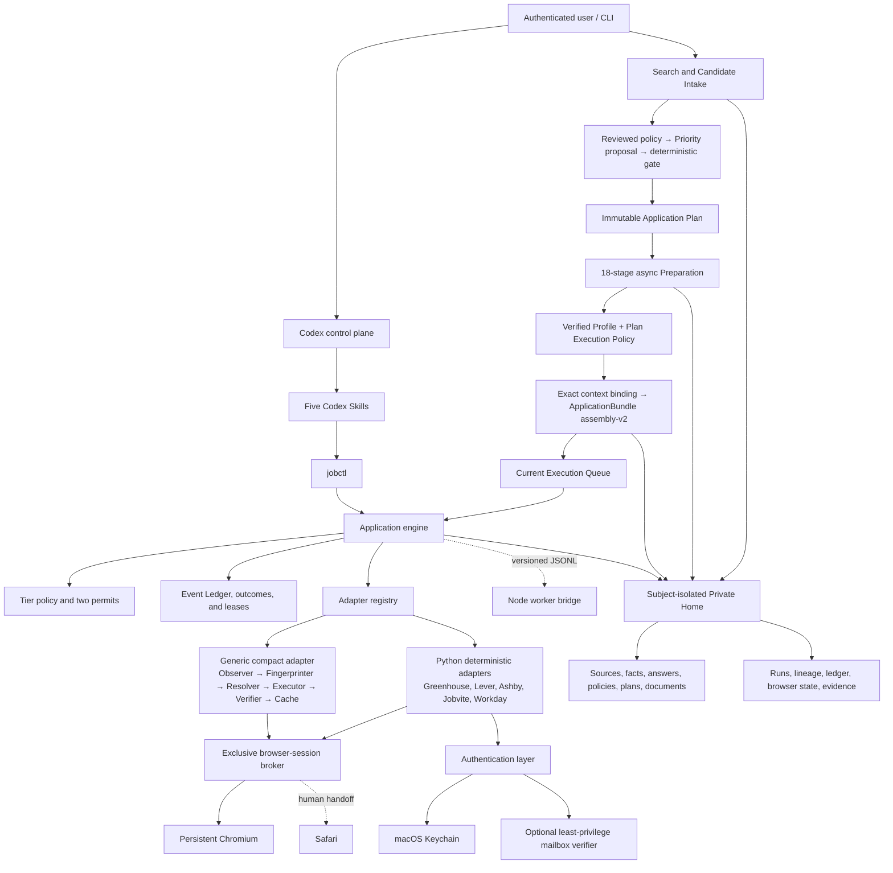

# Jobops

> A Codex-native job application operating system for lazy job seekers: deterministic ATS automation that balances speed and application quality while keeping JavaScript-heavy browser work—and token use—low.

Jobops turns authenticated job intake and a private queue into resumable,
evidence-backed application plans. Codex handles bounded interpretation and
exceptions; deterministic services own source registration, prioritization,
material preparation, policy, assembly, permits, and ATS execution. The first
release focuses on reaching Review reliably on Greenhouse, Lever, Ashby,
Jobvite, and Workday—not pretending every website can be submitted
autonomously.

The repository is public-safe by design. Candidate facts, verified answers, resumes, generated materials, queue state, browser sessions, evidence, and logs live in a repository-external Private Home. ATS and mailbox account passwords plus the permit HMAC key live in macOS Keychain. Optional AI-provider API tokens are read from runtime environment variables only and are never persisted in the repository or Private Home.

Login and account registration are automated states, not routine user tasks. Jobops checks a host-and-tenant-scoped Keychain item first; when none exists and policy allows registration, it generates a strong password, verifies the Keychain write before form entry, completes safe registration fields, keeps optional marketing consent disabled, and accepts required account/privacy terms. It pauses only at CAPTCHA, MFA, email verification that the optional mailbox agent cannot complete, or an account lock. The page is handed off with all other safe fields already complete, then resumed automatically after verification.

## Current status

The implementation now includes:

- a secure Private Home and migration from the existing ApplyPilot/MR.Jobs profile;
- subject-scoped Search Profiles, bounded typed Greenhouse board search, manual
  Job Library refresh, deterministic candidate validation, and immutable
  JobPosting lineage;
- a reviewed, versioned Prioritization Policy; a provider-neutral async
  Priority Agent over the same capability resolver used by Preparation; a
  deterministic validation gate; and immutable P0–P3 decisions;
- immutable Application Plans and an 18-stage async Preparation recipe whose
  nine Agent-backed stages use strict, single-generation structured adapters;
- a Candidate Information Source registry for files, URLs, and user
  statements; deterministic source projections; evidence-bound Agent fact
  proposals; authenticated review decisions; and immutable verified identity
  facts;
- Plan-scoped verified execution profiles, Plan-bound execution-policy
  decisions, exact Profile/Policy context bindings, assembly-v2 lineage, and a
  stateless production `ApplicationBundle` factory;
- a versioned `ApplicationOutcome`, stable exit codes, append-only Event Ledger, compare-and-swap run state, exclusive run/browser leases, and duplicate-submit protection;
- two HMAC-signed, expiring, one-time permits bound to job, material, answer, policy, and Review hashes;
- a shared Adapter Protocol with deterministic Greenhouse, Lever, Ashby, and Jobvite adapters;
- a deterministic Workday login, registration, email-verification handoff, multi-stage application, Review, submit, and confirmation state machine;
- a macOS Security.framework credential backend that never passes passwords in process arguments;
- host-and-tenant-scoped Keychain credentials for long-tail ATS account registration;
- a compact generic adapter split into observer, fingerprinter, resolver, executor, verifier, and value-free recipe cache;
- a persistent Chromium browser broker and Safari human-handoff option;
- a versioned JSON-lines Node worker bridge so Node and Python can coexist while Python remains the production adapter runtime;
- five thin Codex Skills: `job-orchestrate`, `job-materials`, `job-apply`, `job-profile`, and `job-status`;
- sanitized HTML/Playwright contract fixtures and synthetic identities.

The production automation composition root is not complete yet. The remaining
blocking boundary is a server-owned, typed Browser runtime/lease provider for
the P2c3/P2c6 execution ports. Consequently, the authenticated Refresh and
Automation Dashboard routes retain their fail-closed unavailable behavior
until that boundary and the final composition wiring are implemented.

This is an early local release. Fixture success is not a claim of current
production-site reliability; ATS markup changes and live account flows still
require observation before a real ≥95% Review-arrival claim.

## Principles

1. Deterministic execution before AI exploration.
2. Zero model calls on known ATS forms.
3. Candidate values stay local; a model may map a label to an existing key but may not invent the value.
4. Submission requires a separate one-time permit and explicit confirmation evidence.
5. A crash or handoff must be resumable without risking a duplicate submission.
6. Application quality scales with job importance.
7. CAPTCHA, MFA, account locks, ambiguous verification, and new sensitive required questions go to a human.
8. Outreach and follow-up are optional extensions and remain disabled.

## Architecture



Codex is the planner, material editor, and exception handler. It should not repeatedly read full pages or remote-control every click. Playwright adapters own stable selectors, read-back validation, page transitions, and evidence capture.

## Quick start

Requires Python 3.11+, Node.js for the optional bridge, and macOS for the production Keychain provider.

```bash
python3 -m venv .venv
.venv/bin/pip install -r requirements-dev.txt
.venv/bin/playwright install chromium
```

Initialize the external runtime and Keychain permit key:

```bash
.venv/bin/python jobctl.py init
```

Import an existing private ApplyPilot workflow without copying it into Git:

```bash
.venv/bin/python jobctl.py migrate /path/to/applypilot-workflow \
  --legacy-profile /path/to/ignored/profile.yaml
```

Inspect policy and the queue:

```bash
.venv/bin/python jobctl.py policy
.venv/bin/python jobctl.py queue --list
```

Run one application to Review, which is the default and does not submit:

```bash
.venv/bin/python jobctl.py apply-csv --limit 1
```

For High jobs, prepare the private job-specific material manifest first, then authorize Gate A when you have reviewed those materials:

```bash
.venv/bin/python jobctl.py apply-csv --limit 1 --approve-gate-a
```

Human Gate B is deliberately a later command. Inspect the browser Review and run record, then approve that exact persisted Review:

```bash
.venv/bin/python jobctl.py status --run-id run-...
.venv/bin/python jobctl.py submit-reviewed --run-id run-... --approve
```

There is no Gate B preapproval flag on `apply-csv`. Low-tier policy may use `apply-csv --submit` autonomously, but it still issues and consumes both permits and still requires explicit confirmation evidence.

Inspect aggregate or run-specific ledger state:

```bash
.venv/bin/python jobctl.py status
.venv/bin/python jobctl.py status --run-id run-...
```

## Job tiers and delegation

Low-risk autopilot is the default migrated policy.

| Tier | Resume | Cover letter | Gate A | Gate B |
|---|---|---|---|---|
| High | Bespoke, rendered, and visually checked | Narrative company/role alignment grounded in a true experience | Human | Human |
| Medium | Closest variant with targeted keyword/order changes | Targeted when useful or required | Codex | Human |
| Low | Approved existing variant | Only when required | Codex | Codex |

The two gates always exist; policy changes only who may issue them. Supervised mode assigns both gates to a human. Full autopilot assigns both to Codex but still cannot override hard stops or invent answers.

## Two-gate submission protocol

Gate A approves the preflight bundle. Human Gate B can be created only in a later invocation after the adapter has filled, read back, validated, fingerprinted, and persisted Review. The fresh browser fingerprint must still equal the previously approved fingerprint. Both permits bind:

```text
run_id + job_id + job_url_hash + material_hash + answer_hash
+ review_hash + policy_hash + expiration + one-time ID
```

Gate B is consumed inside the trusted core immediately before a submission intent is reserved. The adapter can click Submit at most once. If confirmation is not observed after the click, the result is `SUBMIT_UNKNOWN`; Jobops will not retry automatically.

`SUBMITTED_VERIFIED` cannot be constructed without at least one eligible `EvidenceRef`, such as explicit confirmation text/URL, an ATS application ID, a network response, screenshot, or correlated confirmation email.

## Adapter Protocol

Each deterministic ATS adapter implements the same lifecycle:

```text
support/probe
  → inspect compact FormIR
  → fill from verified local values
  → validate through DOM read-back
  → prepare redacted Review digest
  → submit with Gate B
  → verify explicit evidence
```

The Review digest binds field keys, validation state, hashed fresh browser read-backs, and uploaded-file content hashes—not candidate values, private paths, or resume filenames.

Routing order:

1. Greenhouse, Lever, Ashby, or Jobvite adapter.
2. Workday deterministic authentication/application state machine.
3. A validated private recipe.
4. Compact generic adapter with at most one semantic classification call per run.
5. User handoff for unsupported or unsafe states.

## Workday state machine

The Workday adapter recognizes and resumes these stages:

```text
job
→ login | register
→ email_verification
→ autofillWithResume
→ myInformation
→ myExperience
→ applicationQuestions
→ voluntaryDisclosures
→ selfIdentify
→ review
→ confirmation
```

It auto-uses a tenant-scoped Keychain credential or creates a strong password when account registration is allowed. It pauses on CAPTCHA, MFA, account lock, ambiguous/missing email verification, or a required question without an exact verified answer. A successful login returns to the application state machine instead of restarting an open-ended browser agent.

Email verification may be delegated to a narrowly scoped, read-only IMAP
provider. It is disabled by default. Enabling it prompts for an IMAP/app
password without echoing it, stores that password only in macOS Keychain, and
writes only non-secret connection metadata to the private policy:

```bash
.venv/bin/python jobctl.py mailbox --host imap.example.com
```

The provider uses TLS, read-only mailbox selection, `BODY.PEEK`, the candidate's
exact email address, and a short correlation window. It returns only a bounded
message projection and a digest-only message ID. Multiple matches, password
reset/security messages, an untrusted sender, a CAPTCHA/MFA prompt, or a
missing/invalid credential all fall back to human verification. Disable the
agent without deleting its Keychain item with:

```bash
.venv/bin/python jobctl.py mailbox --disable
```

## Generic adapter and token budget

The legacy 1,821-line production path has been replaced by small components:

```text
observer.py       one bounded DOM observation; no full HTML by default
fingerprinter.py  stable value-free page signatures
resolver.py       canonical local mapping and verified value injection
executor.py       deterministic type-aware fill and navigation
verifier.py       exact read-back and strict confirmation detection
cache.py          selectors and canonical keys only; never candidate values
```

Known fields and cached recipes use zero model calls. `--semantic-mapper` may make one compact classification request only, through a structured-output API backend or through Claude Code/Codex CLI guided by a defined system prompt; without a configured backend, an unknown required field becomes a user handoff. A model response cannot create facts, map sensitive fields for automatic use, or bypass exact option/read-back checks. API keys are accepted only by environment-variable name or `${ENV_NAME}` reference, never as profile literals.

## Private Home

The default path is `~/Library/Application Support/Jobops`; set `JOBOPS_HOME` to override it. Jobops rejects any Private Home located inside a Git worktree.

```text
Jobops/
  profile/
    facts.json
    verified-answers.json
    policy.json
    source/
    backups/
  queue/job_pool.csv
  documents/
    master/
    generated/<job_id>/
      manifest.json
    manifest.json
  state/events.sqlite3
  browser/chromium/
  cache/private-recipes/
  evidence/
  logs/
```

Directories are `0700`; private files are `0600`. The migration copies referenced resumes, authored resume sources, existing cover-letter sources/PDFs, queue data, and the existing answer/routing references. It never migrates passwords into the vault. Verified answer records require source, sensitivity, scope, confirmation time, and optional expiry; malformed, expired, or out-of-scope values never reach an adapter.

High and Medium jobs fail closed before browser launch until `job-materials` creates a job-bound manifest with content hashes, verified-facts attestation, and passed visual QA. High additionally requires a bespoke-resume and narrative-alignment attestation. Missing materials are work for Codex, not a request for the user to write them.

## Outcomes and exits

Detailed results are versioned JSON. Stable process exits remain intentionally broad:

| Exit | Meaning |
|---:|---|
| `0` | Completed or reached Review |
| `2` | Invalid input/configuration |
| `10` | User action required |
| `11` | Waiting for Gate A |
| `12` | Waiting for Gate B |
| `20` | Retryable failure |
| `30` | Unsupported/terminal failure |
| `40` | Policy block |
| `50` | Internal error |

Important statuses include `MATERIALS_REQUIRED`, `REVIEW_READY`, `NEEDS_USER_*`, `AWAITING_GATE_A`, `AWAITING_GATE_B`, `SUBMIT_UNKNOWN`, and `SUBMITTED_VERIFIED`.

## Codex Skills

The public Skills live in Codex's auto-discovered repository path,
`.agents/skills/`. They contain workflow instructions only and never candidate
data. See the official [Codex skill authoring guide](https://learn.chatgpt.com/docs/build-skills#where-to-save-skills).

| Skill | Responsibility |
|---|---|
| `job-orchestrate` | Queue order, tier policy, permits, and safe continuation |
| `job-materials` | Resume routing/tailoring, narrative letters, and fact QA |
| `job-apply` | One bounded adapter episode to Review or verified submission |
| `job-profile` | Private facts, answers, provenance, policy, and Keychain boundaries |
| `job-status` | Ledger/queue outcomes, blockers, metrics, and evidence coverage |

Outreach, LinkedIn networking, cold email, and scheduled follow-up are not part of these core Skills.

## Node and Python coexistence

Python currently owns the workflow engine and production adapters. `workers/node/worker.mjs` implements a standard-library, versioned JSON-lines sidecar for capability discovery and deterministic ATS probing. `core/node_worker.py` communicates only over stdin/stdout with a minimal environment, validates IDs and schemas, applies timeouts, and keeps payloads out of process arguments. This allows incremental Node worker adoption without rewriting the Python safety core.

## Tests and targets

Run the local suite without live-site smoke tests:

```bash
.venv/bin/python -m pytest -q --ignore=tests/test_real_forms.py
```

Run sanitized Playwright contracts after installing Chromium:

```bash
.venv/bin/python -m pytest -q \
  tests/test_ats_adapter_contract.py tests/test_workday_adapter.py
```

The V1 acceptance targets are:

- supported-ATS Review arrival ≥95%;
- median model calls on normal forms = 0;
- unknown-question misanswers = 0;
- duplicate submissions = 0;
- `SUBMITTED_VERIFIED` evidence coverage = 100%;
- humans handle only policy/final confirmation, CAPTCHA/MFA, email-verification fallback, account lock, and new sensitive required answers; Codex prepares missing materials.

Contract fixtures test these invariants locally. Real-site metrics must be reported separately and must never be inferred from fixtures.

## Repository layout

```text
adapters/           shared protocol, ATS adapters, generic components, registry
auth/               credential and optional mailbox providers
core/               outcomes, policy, permits, ledger, leases, bundles, engine
.agents/skills/     five auto-discovered, repository-scoped Codex Skills
workers/node/       JSON-lines Node sidecar
tests/fixtures/     sanitized ATS and Workday HTML
jobctl.py           current Jobops CLI
main.py             legacy MR.Jobs-compatible CLI during migration
utils/              reused discovery, LLM, CSV, and browser utilities
```

## Provenance

This repository intentionally preserves and builds on the current MR.Jobs Git history, including its MIT license. Jobops reuses the working CSV/discovery/LLM foundation while replacing application execution with explicit privacy, protocol, outcome, lease, permit, and evidence boundaries. Ideas from `AkbarDevop/ai-job-agent` informed lifecycle orchestration and optional extensions; outreach remains disabled and no provenance claim should exceed code actually copied into this repository.

## Non-goals

Jobops will not bypass CAPTCHA, MFA, account locks, or anti-abuse systems; fabricate candidate facts; store passwords in files; count a click as a submission; blindly retry uncertain submissions; publish private runtime data; or use Codex as a high-token remote-control loop when deterministic execution is available.
