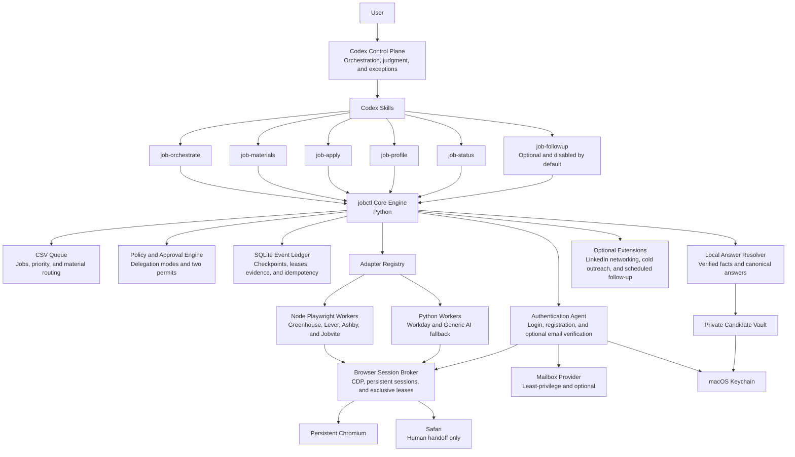

# Jobops

> An AI-native job application operating system for people who want the outcome, not a second job managing applications.

Jobops is a Codex-oriented, automation-first platform for managing the full job application lifecycle: prioritizing a CSV queue, preparing tailored materials, completing ATS applications, handling authentication and optional email verification, submitting under configurable supervision, tracking outcomes, and analyzing the pipeline.

The project is designed for one defining user: **someone who wants to do as little repetitive work as possible without sacrificing application quality, factual accuracy, privacy, or control**.

> [!IMPORTANT]
> Jobops is currently in the architecture phase. This repository does not yet contain a working application engine.

## Product principles

1. **Deterministic execution before AI exploration.** Stable Playwright adapters handle known ATS workflows. Codex is reserved for orchestration, material quality, semantic exceptions, and recovery.
2. **Automation is configurable, not all-or-nothing.** Users can review everything, delegate only routine work, or authorize full policy-bounded autopilot.
3. **Quality scales with opportunity value.** Important roles receive tailored resumes and narrative cover letters; routine roles reuse verified material variants.
4. **Personal facts are never invented.** AI may map a question to a verified answer, but it may not create identity, employment, legal, work-authorization, compensation, or EEO facts.
5. **Submission is evidence-based.** Clicking a button is not proof of submission. Jobops records success only after explicit confirmation evidence.
6. **Private data stays outside the public repository.** Credentials live in macOS Keychain; candidate data, resumes, browser state, and learned site recipes live in a private runtime home.
7. **Every run is resumable and idempotent.** A crash, browser restart, or verification handoff should not restart the entire application or risk a duplicate submission.
8. **The common path should use zero model calls.** Known ATS pages and known questions should execute from deterministic schemas, local answer resolution, and cached recipes.

## Delegation modes

Jobops separates the safety gates from the identity of the approver. The two internal gates always exist, but a human or a policy engine can issue the permit depending on the selected mode.

| Capability | Supervised | Low-risk autopilot | Full autopilot |
|---|---:|---:|---:|
| Rank the CSV queue | AI | AI | AI |
| Select an existing resume | AI proposes, human approves | AI | AI |
| Tailor a resume and cover letter | AI proposes, human approves | AI for policy-approved roles | AI |
| Fill verified routine answers | AI | AI | AI |
| Create ATS accounts and use Keychain credentials | Optional | AI | AI |
| Check recent mail for verification | Optional | AI, with fallback | AI, with fallback |
| Resolve new sensitive or ambiguous questions | Human | Human | Human unless explicitly pre-authorized |
| Approve preflight gate | Human | Policy engine for low-risk roles | Policy engine |
| Approve final submit gate | Human | Policy engine for low-risk roles; human otherwise | Policy engine |
| Handle CAPTCHA, account lock, or mailbox ambiguity | Human | Human | Human |

A custom policy mode can enable or disable each capability independently. Delegation is scoped by job priority, ATS, company, geography, answer sensitivity, material type, and submission risk.

## High-level architecture



## Responsibility boundaries

### Codex control plane

Codex is the planner and exception handler, not the routine browser driver. It should:

- select the next application according to priority, risk, and budget;
- decide whether a role needs tailored materials;
- produce or review an important-role resume and narrative cover letter;
- interpret compact unknown-field descriptions;
- request user input only when a verified answer or safe policy decision is unavailable;
- explain standardized run outcomes and resume from checkpoints;
- analyze pipeline performance from bounded, deterministic summaries.

Codex should not repeatedly read full pages, inspect every click, load the entire application history, or receive secrets simply to complete known fields.

### Core engine

The Python core is the authoritative workflow engine. It owns:

- CSV queue import, ordering, stable job IDs, and atomic status projection;
- policy evaluation and delegation mode selection;
- immutable application bundles and material hashes;
- state transitions, run leases, checkpoints, and duplicate-submit prevention;
- adapter routing and versioned protocol validation;
- approval permit issuance and verification;
- redacted event logging, evidence references, and metrics;
- synchronization between the user-editable CSV queue and the execution ledger.

The CSV remains the user-friendly source of planned jobs, priorities, and routing preferences. SQLite is the transactional source of execution events, approvals, attempts, and evidence. A stable `job_id` and `row_version` prevent silent conflicts.

### Playwright execution plane

Playwright adapters perform the stable browser work. They should use semantic locators, ATS-specific attributes, read-back validation, and explicit state machines instead of open-ended visual navigation.

Only the Browser Session Broker launches persistent Chromium. Python and Node workers connect through CDP and acquire an exclusive run lease before mutating an application. This prevents profile corruption and concurrent submission attempts.

Safari remains available for user-facing handoff, but automated execution uses persistent Chromium because Playwright cannot reuse the user's Safari cookie database reliably.

## Adapter strategy

Jobops uses the following routing order:

1. A deterministic Greenhouse, Lever, Ashby, or Jobvite adapter.
2. A deterministic Workday authentication and application state machine.
3. A previously learned, validated private site recipe.
4. A compact generic AI form adapter.
5. Visual browser control or human handoff as the final fallback.

Every adapter implements the same versioned lifecycle:

```text
probe(context) -> SupportReport
ensure_auth(context) -> StageResult
inspect() -> FormIR
fill(application_bundle, answer_resolver) -> FillReport
validate() -> ValidationReport
prepare_review() -> ReviewDigest
submit(one_time_permit) -> SubmissionEvidence
verify_submission() -> VerificationResult
resume(checkpoint) -> StageResult
```

The `submit` action is not part of the normal fill action set. An adapter cannot click a final submission control without a valid one-time permit.

### Specialized adapters

Greenhouse, Lever, Ashby, Jobvite, and Workday must become tested, platform-aware adapters rather than collections of per-job selectors. Each adapter owns:

- URL and tenant detection;
- authentication requirements;
- stable locator strategies;
- file upload behavior;
- multi-step navigation;
- required-field and error validation;
- review-page extraction;
- submission confirmation evidence;
- resumable checkpoints;
- sanitized HTML fixtures and Playwright contract tests.

### Generic AI fallback

The generic adapter preserves the useful self-healing form behavior without turning every application into a long browser conversation. It is split into:

```text
Observer -> Fingerprinter -> Resolver -> Executor -> Verifier -> Navigator -> Recipe Cache
```

It sends Codex only a compact `FormIR` diff for unresolved controls. Real candidate values remain local and are injected by the answer resolver after semantic mapping.

## Low-token execution path

The normal path for a supported ATS is:

```text
Route URL
  -> match adapter and page fingerprint
  -> load validated schema or recipe
  -> resolve canonical answers locally
  -> fill with Playwright
  -> validate through DOM read-back
  -> prepare review digest
```

This path should require zero model calls.

When a page changes:

```text
Detect structural diff
  -> try stable attributes
  -> try role and label locators
  -> try a validated tenant recipe
  -> send only unresolved FormIR controls to local Codex
  -> map controls to canonical answer keys
  -> inject values locally
  -> validate and cache the new recipe variant
```

Full HTML, complete accessibility trees, long terminal histories, and repeated screenshots are not default model inputs. Screenshots are captured only for focused failure diagnosis or submission evidence.

## Candidate data model

The private candidate vault separates four concerns:

- **Facts:** name, contact details, locations, education, experience, and verified accomplishments.
- **Answers:** reusable canonical answers with provenance, geographic scope, sensitivity, confirmation time, and optional expiry.
- **Policies:** delegation mode, submission authority, account-creation permission, salary strategy, sensitive-answer rules, and material budgets.
- **Documents:** master resumes, reusable bullet blocks, rendered variants, cover letters, hashes, and quality reports.

An answer record is more than a question-to-string mapping:

```yaml
canonical_key: work_authorization_canada
value: true
source: user
scope:
  countries: [CA]
sensitivity: legal
confirmed_at: 2026-07-14
expires_at: null
```

Resolution order:

1. Exact canonical answer.
2. Validated ATS or tenant recipe.
3. Local synonym and option mapping.
4. Codex semantic mapping to an existing canonical key.
5. User handoff if the mapping is ambiguous or no verified answer exists.

Models may map a question to a fact; they may not create the fact. New required questions involving work authorization, criminal history, conflicts, sanctions, government relationships, non-competes, compensation commitments, or EEO data pause unless an exact in-scope answer or explicit policy exists.

## Private runtime layout

The public repository contains only source code, schemas, synthetic fixtures, examples, and documentation. Real user data lives outside the checkout:

```text
~/Library/Application Support/Jobops/
  profile/
    facts.enc
    answers.enc
    policies.yaml
  queue/
    job_pool.csv
  documents/
    master/
    generated/
  state/
    events.sqlite
  browser/
    chromium/
  cache/
    private-recipes/
  evidence/
  logs/
  tmp/
```

Security rules:

- runtime directories use `0700`; private files use `0600`;
- ATS and mailbox credentials live in macOS Keychain;
- profile and answer encryption keys live in Keychain, not configuration files;
- CSV files contain credential references and artifact IDs, never passwords;
- logs do not contain cookies, passwords, candidate values, complete email bodies, or unredacted full-page captures;
- persistent browser profiles never enter Git, release archives, or diagnostic bundles;
- public tests use synthetic identities and a fake credential provider;
- secret-scanning and privacy canaries run before release.

## Authentication and email verification agent

Email verification is an optional authentication capability, not an outreach feature. When enabled, the Auth Agent may:

1. query only recent messages within a short time window;
2. correlate the application by recipient, ATS tenant, company, sender domain, subject, and run timestamp;
3. extract a verification code or same-domain verification link locally;
4. validate that the message is an account/application verification message rather than a password-reset or security-alert message;
5. enter the code or open the link in the leased application browser session;
6. resume the exact adapter checkpoint;
7. discard message content from working memory and retain only redacted evidence.

The agent hands control to the user when mailbox access is unavailable, multiple messages are plausible, a link is expired, the sender cannot be trusted, a security alert is detected, or verification triggers CAPTCHA, MFA, or an account lock.

Mailbox providers must use the minimum practical permission scope. The mailbox agent does not scan or summarize unrelated mail.

## Material quality policy

Material effort is configurable by job importance:

- **High priority:** parse and cache the JD, select verified experience blocks, tailor summary and ordering, preserve factual claims, render and visually validate a dedicated resume, and write a narrative cover letter connecting the candidate's experience to the role and company mission.
- **Medium priority:** route the closest verified resume variant and apply limited keyword or ordering changes when useful.
- **Low priority:** use an approved standard variant unless the application requires additional material.

Each run produces an immutable application bundle containing the job digest, resume hash, cover-letter hash, answer-set hash, policy version, and material-quality report. Submission permits bind to this bundle.

## Two-gate submission protocol

The two gates are execution invariants in every delegation mode.

### Gate A: preflight permit

Gate A authorizes the application scope and materials. Its digest includes:

- company, role, location, and canonical job URL;
- selected delegation mode and risk classification;
- resume and cover-letter hashes;
- important material summaries;
- answer-set hash and sensitive-answer report;
- adapter and policy versions.

A human signs Gate A in supervised mode. A policy engine may sign it for an authorized batch or risk class in an autopilot mode.

### Gate B: final submit permit

Gate B is issued only after the adapter reaches and validates the final review state. It binds:

```text
run_id
+ job_id
+ canonical_job_url
+ resume_sha256
+ answer_set_sha256
+ review_fingerprint
+ policy_version
+ expiration
```

Any page, answer, material, job, or policy change invalidates the permit. In supervised mode a human issues Gate B; in authorized autopilot modes the policy engine may issue it.

Before clicking Submit, the core writes a `submission_intent`. After the click, the adapter must find explicit success evidence or an account-level application record. A network failure after the click produces `SUBMIT_UNKNOWN`, never an automatic second click.

## State model

The job lifecycle is separate from the browser run lifecycle.

```text
QUEUED
  -> MATERIALS_READY
  -> PREFLIGHT_APPROVED
  -> APPLYING
  -> REVIEW_READY
  -> SUBMIT_APPROVED
  -> SUBMITTING
  -> SUBMITTED_VERIFIED
```

Side states include:

```text
NEEDS_USER
NEEDS_USER_EMAIL_VERIFICATION
NEEDS_USER_CAPTCHA
NEEDS_USER_UNKNOWN_QUESTION
AUTH_LOCKED
RETRYABLE
FAILED_FATAL
SKIPPED
WITHDRAWN
SUBMIT_UNKNOWN
```

The event ledger is append-only. State transitions use compare-and-swap versions, and every active job has a lease so two workers cannot submit the same application concurrently.

## Standard process exits

Detailed outcomes are always returned as versioned JSON. Process exit codes remain small and stable:

| Exit code | Category |
|---:|---|
| `0` | Command completed successfully |
| `2` | Invalid input or configuration |
| `10` | User action is required |
| `11` | Waiting for Gate A |
| `12` | Waiting for Gate B |
| `20` | Retryable failure |
| `30` | Unsupported or permanent failure |
| `40` | Blocked by safety policy |
| `50` | Internal error |

Example:

```json
{
  "protocol_version": "1.0",
  "status": "NEEDS_USER_EMAIL_VERIFICATION",
  "reason_code": "MAILBOX_MATCH_AMBIGUOUS",
  "run_id": "run_...",
  "job_id": "job_...",
  "phase": "AUTHENTICATE",
  "checkpoint": "workday.account.verify_email",
  "retryable": true,
  "safe_to_resume": true,
  "evidence_refs": []
}
```

## Codex Skills

Skills are intentionally thin. They call stable CLI operations and interpret bounded structured results rather than reimplementing browser logic in prompts.

| Skill | Responsibility | External side effects |
|---|---|---|
| `job-orchestrate` | Queue selection, policy routing, budget selection, and checkpoint recovery | None directly |
| `job-materials` | JD digest, resume routing and tailoring, narrative cover letters, and material QA | Writes versioned local artifacts |
| `job-apply` | Adapter execution, gate handling, standardized outcomes, and browser handoff | May apply or submit under policy |
| `job-profile` | Verified facts, canonical answers, policies, and provenance | Updates private vault only |
| `job-status` | Funnel, blocker, response, adapter, and token analysis | Read-only |
| `job-followup` | Follow-up drafting and optional delivery | Disabled by default; delivery requires separate authority |

LinkedIn networking, cold outreach, and scheduled day-seven follow-up live in an optional extension. They are not installed or enabled by the core workflow.

## Proposed repository layout

```text
Jobops/
  AGENTS.md
  README.md
  pyproject.toml
  package.json
  .codex/
    config.toml
  core/
    queue/
    policy/
    state/
    approvals/
    answers/
    materials/
    outcomes/
  adapters/
    protocol/
    greenhouse/
    lever/
    ashby/
    jobvite/
    workday/
    generic_ai/
  browser-runtime/
    broker/
    sessions/
    evidence/
  auth/
    keychain/
    mailbox/
  cli/
    jobctl/
  skills/
    job-orchestrate/
    job-materials/
    job-apply/
    job-profile/
    job-status/
  extensions/
    followup/
    outreach/
  schemas/
  tests/
    contract/
    fixtures/
    integration/
    privacy/
  docs/
    adr/
  THIRD_PARTY_NOTICES.md
```

## Reuse strategy

Jobops is a clean repository and does not inherit the Git history of an upstream project. Reuse is selective:

- copy only the modules or techniques that materially reduce implementation risk;
- adapt copied code to the Jobops protocol instead of preserving upstream architecture by accident;
- record the upstream repository, commit SHA, original path, license, and modifications;
- retain required copyright and license notices in copied files;
- list all substantial reused work in `THIRD_PARTY_NOTICES.md`;
- prefer wrappers first and refactoring after contract tests exist.

Initial sources of ideas and selectively reusable code include:

- [humancto/mr-jobs](https://github.com/humancto/mr-jobs): CSV queue behavior, local LLM backend work, generic form techniques, and the Workday/Keychain direction.
- [AkbarDevop/ai-job-agent](https://github.com/AkbarDevop/ai-job-agent): agent workflow shape, ATS script seeds, tracker/dashboard ideas, material rendering, and optional outreach components.

Existing ATS scripts are treated as implementation seeds, not production-ready adapters. Stable support requires shared contracts, sanitized fixtures, multi-step coverage, explicit validation, recovery, and submission evidence.

## Testing and evaluation

Jobops will use local mock ATS applications and sanitized contract fixtures for deterministic CI. CI must never create real accounts or submit real job applications.

Required test areas include:

- legal and illegal state transitions;
- permit binding, expiry, invalidation, and authority;
- duplicate-submit and `SUBMIT_UNKNOWN` handling;
- browser-session leases and process recovery;
- CSV and SQLite conflict detection;
- ATS locator and multi-step contract fixtures;
- SPA rerendering, iframe behavior, client validation, and upload controls;
- login, registration, email verification, CAPTCHA, MFA, and account-lock branches;
- unknown-question resolution and sensitive-answer policies;
- candidate-value isolation from generic AI prompts;
- Keychain and mailbox provider fakes;
- redaction across logs, events, screenshots, prompts, and process arguments;
- resume fact preservation and rendered-document quality.

Target product metrics:

- at least 95% review-page arrival on supported ATS fixtures;
- median of zero model calls for known ATS forms;
- no repeated full-page model observations on an unchanged step;
- zero fabricated candidate answers;
- zero duplicate submissions;
- 100% evidence coverage for `SUBMITTED_VERIFIED`;
- human handoff limited to policy-required review, ambiguity, CAPTCHA/MFA, account lock, inaccessible mailbox, or unsupported site changes.

## Delivery roadmap

### Phase 0: contracts and provenance

- Freeze architecture decisions as ADRs.
- Define the adapter protocol, outcome schema, reason codes, and reuse manifest.
- Establish synthetic identities and privacy canaries.

### Phase 1: core safety and private runtime

- Implement private-home discovery, candidate projections, Keychain abstractions, queue IDs, event ledger, leases, checkpoints, and both approval permits.
- Add delegation modes and custom capability policies.

### Phase 2: first vertical slice

- Implement Greenhouse end to end through the shared adapter protocol.
- Reach review, issue permits, submit in a mock environment, verify evidence, and resume after interruption.

### Phase 3: major ATS adapters

- Add Lever, Ashby, and Jobvite.
- Build sanitized contract fixtures and adapter health metrics.

### Phase 4: Workday and authentication

- Complete the Workday login, registration, and application state machines.
- Add secure tenant credentials, persistent sessions, and optional email verification providers.

### Phase 5: generic AI fallback

- Introduce compact FormIR, page fingerprints, recipe caching, local answer injection, diff-only Codex mapping, and focused recovery evidence.

### Phase 6: Codex Skills and material intelligence

- Add the core Skills, important-role resume tailoring, narrative cover letters, status analysis, and budget telemetry.

### Phase 7: optional extensions

- Add opt-in email follow-up, scheduled follow-up, LinkedIn networking, and cold outreach without enabling them in the default installation.

## Non-goals

Jobops will not:

- bypass CAPTCHA, MFA, account locks, or anti-abuse systems;
- replay or inject CAPTCHA tokens;
- fabricate candidate history, identity, eligibility, or sensitive answers;
- mark an application submitted without explicit evidence;
- retry an uncertain submission blindly;
- place real user data, credentials, resumes, mailbox content, or browser state in the public repository;
- turn Codex into a high-token remote-control loop when a deterministic adapter can do the work.

## Project status

Architecture approved for initial implementation. The next milestone is Phase 0: protocol, privacy, provenance, and test scaffolding.
