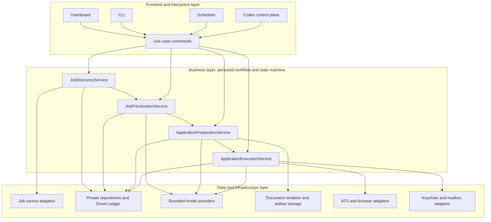
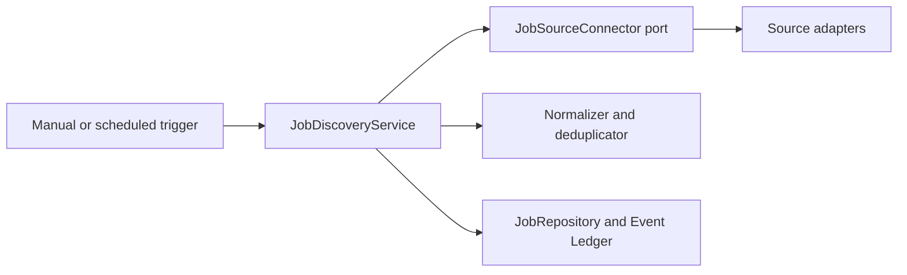
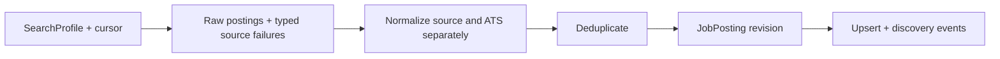
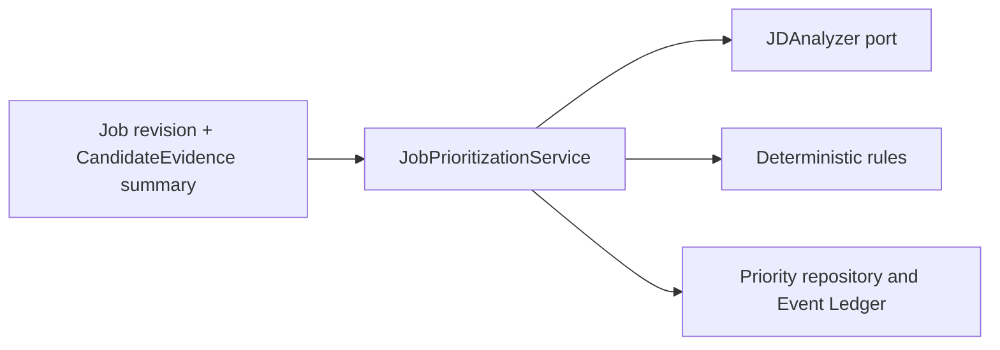
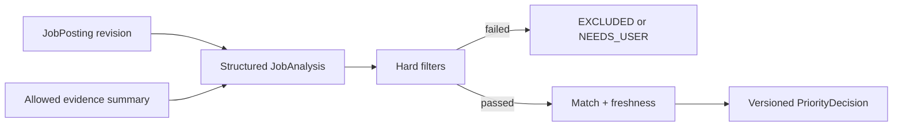
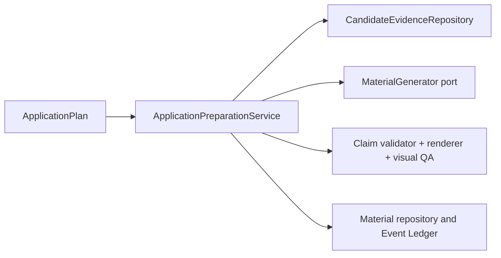
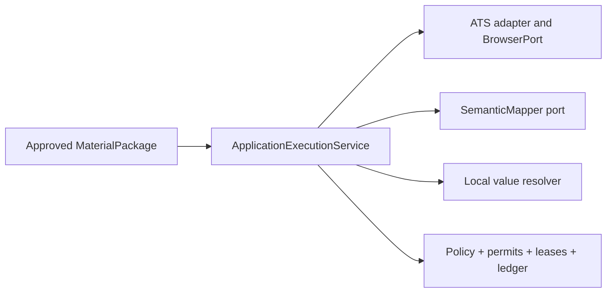

# Jobops Architecture

## 三层架构

This is the target V1 architecture. Current status is recorded in `CONTRACTS_AND_TESTS.md`: Execution is established, Preparation is partial, Discovery is legacy, and Prioritization is still a target contract.

Jobops 采用 workflow-first modular monolith。四个业务组件先以进程内 typed contract 协作；只有出现独立 trust boundary、release lifecycle、availability target 或 scaling profile 时，才拆成独立服务。Workflow coordination is a persisted state-machine responsibility, not a fifth service.



Frontend、CLI、Scheduler 和 Codex 只能调用业务用例。它们不能直接组合 repository、model、browser、permit 或 submit 行为。

## 四个核心业务组件

| Component | Owns | Does not own |
|---|---|---|
| `JobDiscoveryService` | source collection、normalization、deduplication、upsert、partial source failure | Priority、材料、ATS 执行 |
| `JobPrioritizationService` | JD analysis、hard filters、match/freshness、P0–P3、`PriorityDecision` | 最终候选人事实、材料生成、queue mutation outside its result |
| `ApplicationPreparationService` | evidence selection、resume strategy、draft、validation、render、prepared bundle、Gate A request | browser、ATS submission、Gate B or the approval actor's decision |
| `ApplicationExecutionService` | ATS routing、fill、read-back、Review、permits、submit、evidence、handoff | JD scoring、无依据的回答、材料改写 |

## 核心数据流


每个下游对象必须绑定它所依赖的 revision 或 content hash：

```text
JobPosting revision
→ PriorityDecision(scoring_version)
→ ApplicationPlan
→ MaterialPackage(base resume, evidence IDs, artifact hashes)
→ ApplicationRun(answer, material and policy hashes)
→ Gate A ApprovalDecision(binding digest)
→ ReviewSnapshot(review hash)
→ Gate B decision
```

Priority 和 lifecycle state 相互独立。`P0–P3` 表示业务优先级；state 表示处理进度；`EXCLUDED` 是 hard-filter decision，不是低优先级。

## Job Discovery

### Component view



### Data flow



一个 source 失败时，其他 source 的成功结果必须保留。Discovery 不决定 Priority，也不能用 source name 推断 ATS。

## Job Prioritization

### Component view



### Data flow



模型可以提取 JD requirements、识别不确定项和提出 evidence alignment；确定性规则负责 hard filter、score aggregation 和最终 P0–P3。模型不能决定 work authorization，也不能直接改变 queue。

## Application Preparation

### Component view



### Data flow



```mermaid
flowchart LR
    P["ApplicationPlan"] --> E["Selected EvidenceSet"]
    E --> D["Resume / CL / answer drafts + evidence bindings"]
    D --> V["Fact and policy validation"]
    V --> R["Render + visual QA"]
    R --> H["Hash-bound MaterialPackage"]
    H --> B["Prepared application bundle"]
    B --> A["Gate A decision by policy actor"]
    A --> O["Approved package or revision request"]
```

Material Generator 只能看到为本次任务选择且允许使用的 evidence。没有 evidence binding 的 claim 必须失败。Gate A binds the complete preflight bundle—job, plan, materials, answers, validation, and policy—not only document bytes. Preparation creates the request and records the decision; policy selects the Human/Codex actor. Any bound change invalidates approval.

## Application Execution

### Component view



### Data flow



```mermaid
flowchart LR
    P["Approved package"] --> R["Route from trusted apply URL"]
    R --> F["Inspect compact FormIR"]
    F --> M["Map unresolved controls without values"]
    M --> V["Resolve verified values locally"]
    V --> W["Fill + read-back"]
    W --> RV["Persist ReviewSnapshot"]
    RV --> GB["Gate B"]
    GB --> SI["Reserve submission intent"]
    SI --> C["Single Submit click"]
    C --> E["Verify evidence"]
    E --> O["ApplicationOutcome"]
```

Known ATS path 必须 deterministic，正常情况下 model calls 为 0。SemanticMapper 只处理 local rules/cache 无法识别的 required control，并且没有 browser、vault、tool 或 submission authority。

The target call is one redacted, bounded batch per `ApplicationRun`, with no selector, element ID, URL, company/job/page identity, or candidate value. Current code has the Protocol and `FakeSemanticMapper`; durable cross-invocation attempt reservation and a concrete provider client are not yet implemented, and the legacy `brain` path is transitional only.

## 关键边界决策

### One workflow, multiple entry points

Manual update、scheduled update、CLI、Dashboard 和 Codex 共用业务入口、repository 和 state transition。Repository-root legacy Dashboard/SQLite data is migration input. Private Home CSV remains a current compatibility queue projection until the canonical repository replaces it; neither may become a second workflow.

### Modular monolith first

逻辑边界先由 Python Protocol、dataclass、JSON Schema 和 tests 固定。不能因为未来可能扩展而预先增加 HTTP、database、framework 或 deployment unit。

`SemanticMapper` V1 therefore remains in-process. It becomes a service only when at least one concrete need exists:

- provider credentials or outbound model traffic require a separate trust boundary;
- multiple Jobops deployments need one governed classifier;
- classifier release, availability, budget, or scaling must be managed independently.

At that point the service isolates credentials and untrusted model input, and centralizes schema/version enforcement, egress, budgets, and redacted metrics. It still owns no candidate data or side effect. Availability loss follows the fail-closed degradation contract in `CONTRACTS_AND_TESTS.md`.

If the mapper is disabled or unavailable, known ATS and local rules/cache continue. A required unresolved control becomes a typed handoff; Jobops does not fall back to an Agent, another provider, or a guessed value.

### Job Source is not ATS

```text
DiscoverySource:
  source_platform
  source_job_id
  source_url
  observed_at

ApplicationTarget:
  application_url
  verified_host
  ats_type
  tenant
```

LinkedIn、Indeed、RSS 或 company careers page 可能发现一个最终由 Greenhouse、Lever、Ashby、Jobvite 或 Workday 执行的岗位。ATS routing 只能来自可信 application URL 和 verified page markers，不能来自 CSV/source hint。

### Models are bounded capability nodes

每个 model port 必须有：

- 一个明确任务；
- input allow-list；
- versioned structured output；
- finite timeout 和 attempt budget；
- no browser、tools、database mutation 或 submission authority；
- local validation 和 fail-closed outcome。

不同能力的数据边界不同：

- `JDAnalyzer` 只接收岗位内容和最小 evidence summary。
- `MaterialGenerator` 只接收已选择且允许用于材料的 evidence。
- `SemanticMapper` 只接收 value-free control metadata，不能接收任何 candidate value。

Models do not receive the complete CandidateVault/profile. Material and analysis capabilities receive only explicitly selected, purpose-allowed evidence; SemanticMapper receives none. This limits prompt-injection-driven disclosure and prevents the classifier from becoming a value source.

### Side effects remain deterministic

只有受信任的业务代码可以：

- 解析并注入 candidate value；
- 修改 workflow state；
- 填写 browser field 或上传 artifact；
- 签发和消费 permit；
- reserve submission intent；
- 点击 Submit；
- 决定 retry 是否合法。

Retry is legal only for an explicitly retryable pre-intent failure with a persisted safe checkpoint, unchanged bindings, and remaining budget. Approval/sensitive-answer blockers, unsupported/schema/read-back failures, and `SUBMIT_UNKNOWN` never auto-retry; exact rules live in `DOMAIN_AND_RULES.md`.

## 为什么模型不能直接执行

JD 和 ATS page 都是不可信输入，可能包含 prompt injection。模型输出本身也可能误判字段、生成 unsupported claim、选择错误 action 或把不确定提交当成成功。

直接执行会产生四类不可接受风险：

1. 候选人数据被发送到第三方或错误字段。
2. 法律、身份、经历或指标被虚构。
3. Submit 等非幂等副作用被重复执行。
4. 不确定结果被误判为成功并触发危险 retry。

| Threat | Boundary control |
|---|---|
| Prompt injection in JD or form text | fixed task, input-field allow-list, no tools, schema validation |
| Candidate data echoed by a page | local redaction, value-free mapper request, metadata-only logs |
| Hallucinated mapper key/index or material claim | whole-batch mapper rejection or claim-to-evidence validation |
| Wrong-field or third-party contact mapping | local structural policy, verified value resolution, read-back |
| Duplicate or uncertain submission | signed permits, durable intent reservation, evidence verification, no retry |
| Model/provider drift | versioned contract and provider-independent test fake |

唯一允许的执行链是：

```text
Model output
→ schema validation
→ allow-list and domain validation
→ immutable typed decision or draft
→ local candidate-value resolution
→ policy, approval, permit and lease checks
→ deterministic executor
→ browser read-back and evidence verification
```

Model output 是待验证数据，不是 executable command。

This workflow does not need an Agent that freely chooses tools: the action sequence, legal transitions, inputs, and stop conditions are already known. The only open problem is bounded classification or generation. Tool autonomy would add permissions and nondeterminism without adding a required product capability.
