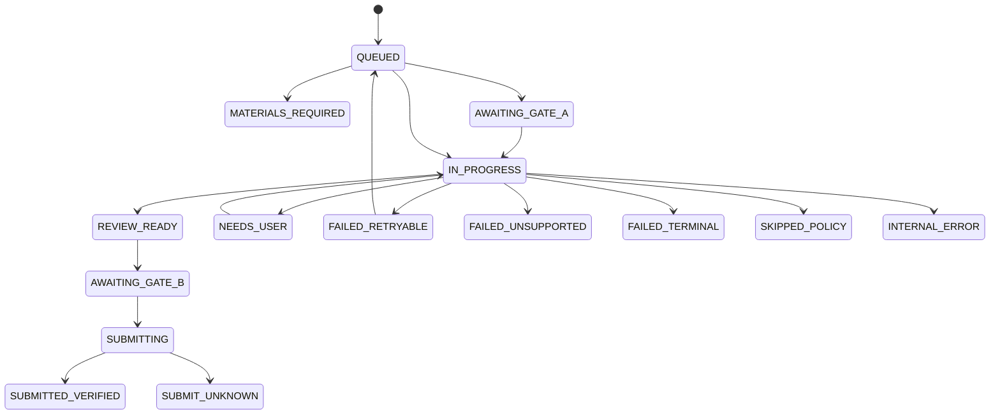

# Jobops Domain and Rules

This document is the authority for domain objects, lifecycle states, and business rules. Interface shapes belong in `CONTRACTS_AND_TESTS.md`; system ownership belongs in `ARCHITECTURE.md`.

## 核心对象

| Object | Meaning | Required identity / binding |
|---|---|---|
| `SearchProfile` | 用户批准的岗位搜索条件、hard filters 和 source 配置 | `profile_id`, `version` |
| `SourceObservation` | connector 返回的一条原始岗位观察；尚不是规范化岗位 | source, external ID/URL, observed time |
| `DiscoveryRun` | 一次 manual/scheduled collection 及各 source 结果 | run ID, profile version, trigger |
| `JobPosting` | 标准化后的岗位及其可申请目标 | `job_id`, source identity, content hash, revision |
| `AcceptedJobIntent` | 某个 subject 在成功 Discovery 后明确接受的 add/apply 业务意图；v2 记录 typed source provenance；不是执行许可 | subject ID, job ID, intent, proposal ID, Discovery run ID, v2 source provenance |
| `PrioritizationPolicyDraft` | AI 对用户自然语言策略的结构化解释；尚未生效 | draft ID, subject ID, interpreter version, expiry |
| `PrioritizationPolicy` | 用户审核并批准的不可变求职策略 snapshot | policy ID, subject ID, version, content hash |
| `JobAnalysis` | 从某个 JD revision 提取的结构化 requirements 和 unknowns | job revision, analyzer version |
| `PriorityProposal` | Priority Agent 对单个岗位的 typed 建议；不是正式业务决定 | job/policy/candidate bindings, agent/prompt/model versions |
| `PriorityDecision` | Validation Gate 接受的 P0–P3、EXCLUDED 或 NEEDS_USER 及解释 | job revision/hash, policy version, candidate summary version, agent versions |
| `CandidateEvidence` | 可用于判断或材料的已验证候选人事实 | evidence ID, source, sensitivity, scope, verification time |
| `ResumeCandidate` | subject 显式注册、hash 校验且可供后续基础简历选择的只读 artifact projection | subject ID, stable resume ID, artifact hash, trusted summary hash |
| `ResumeSelectionDecision` | 针对一个 ApplicationPlan 自动选择的不可变基础简历绑定 | plan/job binding, candidate-set hash, source resume ID/hash, selector versions |
| `SourceResumeProjection` | 受管理源简历的忠实、可引用结构投影；不是 CandidateEvidence | subject/resume/artifact hash, parser version, projection hash |
| `ResumeVersion` | 已审批、可追溯的基础或定制简历 | resume ID, revision, artifact hash, evidence bindings |
| `ApplicationPlan` | automation-first 的单职位准备授权、阶段、运行时用户要求和人工例外策略 | subject/job revision, priority decision, policy version, accepted intent, instruction hash |
| `MaterialPackage` | Resume、Cover Letter 和 answers 的不可变申请材料包 | plan, evidence IDs, artifact hashes, package revision |
| `ApprovalDecision` | Gate A 或 Gate B 的明确审批记录 | actor, binding digest, decision time |
| `ApprovalPermit` | 由审批产生的签名、限时、一次性执行能力 | gate, run, digest, expiry, nonce |
| `ApplicationRun` | 一次可恢复、不可并发的 ATS 执行 | run ID, plan/package/policy revisions, lease |
| `ReviewSnapshot` | 提交前 DOM read-backs、uploaded bytes 和 validation 的安全绑定 | run, review hash, observed time |
| `SubmissionIntent` | Gate B 后、Submit 前持久化的单次副作用预留 | application key, review/material/answer/policy hashes |
| `EvidenceRef` | 对确认文本、URL、ATS ID、网络响应等证据的隐私安全引用 | kind, hash/URI, observed time |
| `HandoffRequest` | 需要用户处理后才能继续的最小任务 | run, reason code, safe checkpoint, requested action |
| `ApplicationOutcome` | 执行的标准化终态或暂停态 | run ID, exact status, evidence refs, retryability |

Candidate data is never inferred. `CandidateEvidence` is valid only when its source, sensitivity, scope, confirmation time, and optional expiry are known.

### Authenticated subject sessions

- A subject-scoped HTTP use case accepts identity only from a successfully
  validated server-side session. Client query, form, JSON, ordinary headers,
  profile fields and conversation IDs are never identity sources.
- The cookie contains an opaque session reference plus credential. Keychain
  stores the session context and only the credential hash; neither the cookie
  credential nor its secret may enter logs, responses or ordinary records.
- Sessions bind exactly one subject, authentication method, issue time, expiry
  and contract version. Explicit `now` determines expiry; future-issued,
  expired, missing, corrupted or hash-mismatched sessions fail closed.
- FastAPI dependencies translate authentication failure to safe 401 responses
  and cross-subject resource access to 403. Business services continue to
  accept a plain explicit subject ID and do not depend on HTTP/session types.

### Accepted job intent provenance

- Persisted v1 records remain their original records: reads do not inject
  provenance, rewrite bytes or change identity.
- New records use v2 and require either `CONVERSATIONAL_INTAKE` provenance with
  its formal proposal source ID, or `SEARCH_PROFILE_REFRESH` provenance with
  one or more canonical, deduplicated and stably ordered profile IDs.
- Provenance records origin only. It cannot authorize SearchProfile automation,
  cancel an earlier request or affect the rule that any valid
  `REQUEST_APPLICATION` takes precedence over `ADD_JOB`.

### `SearchProfile`

- A SearchProfile is mutable user configuration represented as immutable,
  subject-specific versions. Its logical profile ID is stable; a content
  change appends the next version and never overwrites history.
- V1 source is only typed `KNOWN_GREENHOUSE_BOARD` with an explicit Greenhouse
  board token. Company, title and optional location are stored as the same
  canonical `JobSearchRequest` semantics used by the supported search port.
- Refresh mode is fixed to `MANUAL`. Profiles store no cron, interval,
  `next_run_at`, due state, CandidateSet, JobPosting or accepted intent.
- Identical canonical content returns `UNCHANGED`; audit timestamps do not
  enter content identity.
- `list_current()` returns one deterministic current version per logical
  profile. `list_enabled()` filters that current view and never returns a
  disabled or cross-subject profile.
- Saving or reading a profile never performs search, Discovery, Priority,
  application planning or execution.

### Manual full job library refresh

- S3b is invoked explicitly with a subject, timezone-aware timestamp, stable
  invocation ID and positive Priority budget. It is not a scheduled or due-task
  operation.
- One fixed `list_enabled()` snapshot is authoritative for the invocation.
  Each profile is searched once using its stored canonical request through a
  provider-neutral executor.
- Search candidates are not JobPostings. Canonical URL identity merges the
  same candidate across profiles before one PublicJobReader and one formal
  Discovery call; all contributing profile IDs remain in the audit result.
- Formal Discovery receives only resolved `ADD_JOB` proposals under
  `MANUAL_LIBRARY_REFRESH`. It owns normalization, identity, revision and
  persistence.
- Missing SearchProfile intent policy defaults to `ADD_JOB_ONLY`. Only an
  explicit, enabled `AUTO_REQUEST_APPLICATION` policy may write a v2
  `REQUEST_APPLICATION` intent after Public Read and Discovery both succeed.
- When profiles share a candidate URL, any explicit auto-enabled source is
  sufficient; all contributing profile IDs are retained in the intent
  provenance. Add-only sources cannot cancel a request.
- Policy changes are immutable versions and affect future refreshes only.
  They do not revoke existing request intent or trigger P1d4, planning,
  preparation or execution.
- Search, read and Discovery failures are isolated. After all candidates, P1d3
  runs at most once even when partial failures occurred. No operation retries.
- A missing result in one bounded search is not evidence that an existing job
  closed or expired; S3b never mutates lifecycle state from absence.
- Subject plus invocation ID provides UI replay protection before profile,
  Search, Reader, Discovery or Priority calls. A different invocation ID is a
  new explicit refresh.

## 状态机

不同对象使用不同状态机。Priority 表示业务价值，lifecycle state 表示处理进度，二者不能合并。

### `DiscoveryRun`

```text
QUEUED → RUNNING → SUCCEEDED | PARTIAL | FAILED
```

`PARTIAL` means at least one connector succeeded and at least one failed. Successful observations are retained; each connector failure is recorded separately.

### `JobPosting`

```text
NORMALIZED
→ ANALYZED
→ PRIORITIZED
→ READY
→ QUEUED

Branches: DUPLICATE | EXCLUDED | SKIPPED | EXPIRED
```

- A `SourceObservation` becomes `JobPosting.NORMALIZED` only after schema and identity checks pass.
- `DUPLICATE` links to the canonical posting; it does not create a second application.
- `EXCLUDED` requires a failed hard filter.
- `EXPIRED` means the target is closed or no longer valid.

### `PrioritizationPolicyDraft` / `PrioritizationPolicy`

```text
DRAFT | NEEDS_CLARIFICATION | READY_FOR_APPROVAL
→ APPROVED | EXPIRED

PrioritizationPolicy:
ACTIVE → SUPERSEDED
```

A draft is an AI proposal and has no effect on Priority. Approval creates an
immutable version. Approving changed content supersedes the previous active
version without rewriting its content or historical decisions.

### Accepted job intent

- An accepted intent is persisted only after Discovery accepts the proposal
  and returns the formal `job_id` and Discovery run identity.
- It is immutable, subject-specific and separate from `JobPosting`,
  process-local `PendingIntake`, Priority and the Application Engine's
  submission-intent reservation.
- `REQUEST_APPLICATION` has precedence over `ADD_JOB` for the same subject and
  job. A later `ADD_JOB` does not cancel an existing request; cancellation
  requires a future explicit typed action.
- Missing historical intent is `NOT_FOUND`. Priority, timestamps, conversation
  state and job source never imply application intent.
- `REQUEST_APPLICATION` permits later read models to consider preparation
  eligibility; it does not create an `ApplicationPlan`, approve materials,
  reserve Submit or authorize execution.

### `ApplicationPlan`

- A plan is created only from one explicitly selected P1d4 `RUNNABLE` item.
  Priority, policy and accepted-intent bindings come from that same snapshot;
  the creator does not perform independent repository lookups.
- The immutable identity binds subject, job revision/content hash, formal
  Decision ID, policy ID/version/hash, accepted REQUEST_APPLICATION intent,
  priority, plan contract version, fixed stages and the exact runtime
  instruction hash. Creation time is audit metadata, not identity.
- The default policy is `AUTOMATION_FIRST`. Safe resume selection/tailoring,
  cover-letter work, answer drafting, Fact QA, Visual QA and material assembly
  proceed asynchronously without requiring the user to remain present.
- `DEFER_ITEM_AND_CONTINUE` means an unresolved human-only issue pauses only the
  current job. A later Human Attention Queue records that exception while other
  jobs continue; P2a1 defines the policy but does not implement that queue.
- User preparation instructions are plan-scoped runtime data, preserved
  exactly and never written to static Agent instructions or another job.
- A plan permits preparation to begin. It does not mean materials are complete,
  satisfy Gate A, authorize browser execution or authorize submission.

### Selective Batch ApplicationPlan Creation

- P2a1b takes either a non-empty ordered job allowlist or a positive
  `max_jobs` bound and reads P1d4 exactly once for the explicit subject and
  timezone-aware `now`.
- Only snapshot items typed `RUNNABLE` call the public P2a1 creator. Every
  blocked status is preserved as `SKIPPED_NOT_RUNNABLE`; an absent allowlisted
  job is `NOT_FOUND`. Neither consumes the P2a1 execution bound.
- Explicit allowlists preserve caller order and first occurrence. Without an
  allowlist, P1d4 snapshot order is authoritative. Calls are serial, at most
  once per job, and a single failure does not stop later runnable jobs.
- Only explicitly supplied per-job preparation instructions cross into P2a1.
  Missing instructions remain `None`; the batch does not derive instructions
  from job text, conversation state, or another job.
- P2a1b has no persistence or retry layer. Repeated runs rely on P2a1 immutable
  identity and `UNCHANGED`, and never start P2b4/P2b6 or execution.

### Trusted resume candidates

- Only an artifact explicitly registered from Private Home
  `documents/master/` can become a `ResumeCandidate`; loose
  `default_resume`, `resume_variants` and runtime fallback paths are not
  candidates.
- Registration reads the actual PDF or DOCX bytes, computes SHA-256 locally
  and copies them to an immutable, subject-scoped preparation artifact path.
  A caller-provided hash is never authoritative.
- The selection-safe summary is accepted only from an authenticated caller as
  either verified or user-confirmed data. P2a2 performs no model inference or
  resume selection.
- Candidate identity binds subject, artifact hash/type, display name, exact
  summary and its trust metadata, selectable status and contract version.
  `recorded_at` is audit metadata. Changed content creates a different record;
  identical registration returns the original immutable record.
- Reads re-hash the managed artifact. A missing artifact, mismatched bytes or
  corrupt record fails the complete typed read/list operation rather than
  silently shrinking the candidate set.

### Automatic base resume selection

- P2a3 starts from one persisted `ApplicationPlan`, then loads one typed
  `JobPosting` and requires exact job ID, revision and content-hash equality
  with the plan before reading candidates.
- The complete candidate set comes only from
  `ResumeCandidateProvider.list_selectable(subject_id)`. No loose profile path,
  filesystem scan or legacy routing value participates.
- Zero candidates defers only that plan. One candidate is selected by ordinary
  code with zero Agent calls. More than one candidate permits one bounded,
  tool-free Agent call over the trusted JD, selection-safe projections and
  exact plan-scoped instructions.
- The Agent may return only one supplied resume ID, candidate contract version,
  artifact hash and bounded rationale. Ordinary code verifies all three
  bindings; refusal, ambiguity or an unknown/mismatched candidate defers the
  plan without retry or a successful Decision.
- The pre-Agent selection binding covers plan/job bindings, candidate-set
  canonical hash, selection contract and configured Agent/prompt/model
  versions. A completed identical binding returns the immutable existing
  Decision without another Agent call. `selected_at` is audit metadata.
- Selection chooses source bytes only. It does not tailor a resume, approve
  materials, create Human Attention state or authorize execution/submission.

### Source resume projection

- P2a4a reads only a subject-owned `ResumeCandidate`; it never accepts an
  external path or scans for documents. Managed bytes are re-hashed before
  parsing and must still match the candidate artifact binding.
- PDF projection uses deterministic page and extracted-line indices. DOCX
  projection uses body paragraph indices and explicit table/row/cell/paragraph
  indices. Parser normalization trims only surrounding extractor whitespace;
  it does not rewrite, infer or complete source text.
- Section recognition is limited to versioned heading/list rules. Content that
  does not match those rules stays a paragraph or table-cell block.
- Stable section, block and bullet IDs depend on artifact hash, structural
  locator, parser version and projection contract—not path, mtime or runtime.
- A `SourceResumeProjection` is source evidence material, not a verified
  `CandidateEvidence` snapshot. P2a4a performs no truth/capability judgment,
  OCR, model call, tailoring, rendering, approval or execution.

### CandidateEvidence snapshot

- P2a4b accepts evidence only from a typed `SourceResumeProjection` bound to
  the subject, selected resume and artifact hash. Selection-safe summaries,
  CandidateSummary, CandidateVault profile fields, JD content and legacy
  profile data are not evidence inputs.
- Every non-empty source block becomes one item in projection section/block
  order. Text, source section/block/bullet IDs and typed locators are copied
  exactly; no skill, responsibility, causality, number or outcome is inferred.
- Resume-source evidence uses sensitivity `PERSONAL`, allowed scope
  `RESUME_TAILORING`, and verification
  `USER_PROVIDED_DOCUMENT_STATEMENT`. This means the user supplied the document;
  it does not claim independent third-party verification.
- Source-resume items have `verified_at=None` and `expires_at=None`. Their
  recorded time comes from the immutable source projection. No expiry is
  invented.
- Evidence and snapshot IDs bind stable source and upstream immutable
  identities, never path, mtime or runtime creation time. Changed Plan,
  Selection, artifact, Projection or contract creates a new immutable snapshot.
- P2a4b does not judge JD alignment, ingest additional CandidateVault evidence,
  tailor content, run Fact/Visual QA or authorize preparation execution.

### Evidence-bound resume tailoring

- P2a4c rewrites resume content only inside the bound
  `CandidateEvidenceSnapshot`. CandidateSummary, selection-safe summaries and
  ordinary profile fields are never tailoring facts.
- The Resume Tailoring Agent policy is static and versioned:
  `Action Verb + Details + Outcome = Skill Statement`, weak verbs banned, JD
  verbs reusable only with evidence support, no new numbers, skills,
  experience, titles, degrees, duties or outcomes without evidence.
- Instruction priority is fixed: facts and the fabrication ban > the current
  Plan's user preparation instructions > JD alignment > default style. User
  instructions are passed verbatim and never edit the global policy.
- The Agent may rewrite, condense, reorder or omit bullets and reorder
  sections; it must not change identity facts (names, companies, titles,
  degrees, dates) or return free text instead of the typed result.
- Every source block must be accounted for exactly once with change type
  `UNCHANGED | REWRITTEN | REORDERED | OMITTED`. Rewritten bullets carry at
  least one valid evidence ID, their source reference and a verbatim JD
  alignment reference.
- Deterministic validation rejects unknown evidence, sections or blocks,
  unevidenced numbers or proper-noun facts, JD verbs without cited evidence,
  weak leading verbs and omission of source text quoted in user instructions.
  Violations defer the item as `DEFERRED_NEEDS_HUMAN` without auto-retry.
- Draft identity binds all upstream immutable identities plus
  Agent/prompt/model/policy/contract versions, never time. A completed
  binding replays `UNCHANGED` with zero Agent calls.
- A `TailoredResumeDraft` is an unreviewed AI rewrite. It authorizes no final
  rendering, Fact QA, Visual QA, human approval or execution.

### Resume fact QA

- P2a5 is an independent gate. Passing the P2a4c validator is never evidence
  that a draft is factually sound; P2a5 re-derives every checkable fact and
  shares no validator with the tailoring Slice.
- Any subject, plan, job revision, artifact, projection, evidence or content
  hash mismatch returns `BLOCKED_BINDING_MISMATCH` with zero Agent calls and
  no persisted result.
- Deterministic checks run first: reference existence, `RESUME_TAILORING`
  scope, source coverage and duplication, verbatim `UNCHANGED`/`REORDERED`
  text, at least one usable evidence reference per rewritten bullet, and
  every number, date, company, title, degree and tool name present in cited
  evidence. A blocking deterministic finding blocks without a model call.
- A JD alignment reference absent from the bound job description is
  `ADVISORY`: it is a provenance defect, not a false candidate claim, so it
  is recorded without blocking.
- The bounded QA Agent is called at most once, only for genuinely semantic
  questions, and receives only rewritten bullets and tailoring-scoped
  evidence — never the JD, projection, CandidateSummary or profile fields.
- The Agent may judge only evidence support: unsupported action verbs,
  overstated ownership, overstated maturity, unsupported impact, unsupported
  causality and out-of-scope claims. Participation written as leadership, a
  prototype written as production deployment, tool use written as business
  impact, and asserted causality the evidence does not state are all
  unsupported.
- The Agent returns findings and a verdict only. It cannot modify the draft,
  propose replacement bullets or call tools. Ordinary code revalidates every
  finding's bullet and evidence references.
- Verdicts are `PASSED`, `BLOCKED` or `DEFERRED`. Unknown references, illegal
  or contradictory output and an uncertain verdict defer the item for a human
  without auto-retry and without blocking other jobs.
- QA identity binds the draft ID and hash, projection, evidence snapshot and
  QA/Agent/prompt/model/policy versions, never time. A completed binding
  replays as `UNCHANGED` with zero Agent calls whatever its verdict.
- `PASSED` covers facts only. It is not layout or visual approval, material
  approval, or authority to render or submit anything.

### Managed LaTeX resume versions

- P2a6a registers only an explicitly submitted `.tex` source, inline or from
  a path already inside Private Home. It never scans a user directory and
  never imports a file on its own initiative.
- Managed bytes are copied into a subject-isolated location under Private
  Home. Nothing downstream may depend on the original external path.
- The SHA-256 is always computed from the actual managed UTF-8 bytes. A
  caller-declared hash is never trusted.
- Registration rejects plainly unsafe capabilities: shell escape, external
  program execution, file writes, file reads and absolute or home-relative
  include paths. Relative includes remain legal. This is admission control,
  not compile safety; sandboxed compilation remains a later Slice.
- `GENERAL_SOURCE_V1` remains the default registration profile and retains
  those rules, including legal relative includes. A caller must explicitly
  select `SINGLE_FILE_BASE_TEMPLATE_V1` to admit a user-supplied base
  template under the stricter P2a6a1 contract.
- The strict profile requires exactly one document root, one empty and
  ordered `JOBOPS-CONTENT-BEGIN/END` region inside that root, and exactly one
  compatible two-argument definition each for `JobopsSection` and
  `JobopsBullet` before the document body. These are layout interfaces, not
  candidate facts and do not depend on a Tailored Draft.
- Strict single-file sources may use only the closed managed-template package
  set and no external files, images, fonts, bibliographies, includes or
  dynamically named file inputs. The shared deterministic capability and
  dependency policies are registration checks; compilation remains P2a7.
- Many LaTeX versions and many root families may be valid at once. There is
  no unique `current_resume.tex` and no single ACTIVE version.
- Nothing overwrites history. An AI revision or template derivation creates a
  new version recording `parent_version_id`.
- A parent must exist under the same subject, and the child inherits that
  parent's root family. A supplied family contradicting the parent fails
  closed.
- A first parentless version derives a new stable root family from its own
  binding. Family is never guessed from a filename or a timestamp.
- User-provided, imported, system-template-derived, AI-generated and
  AI-revised sources share one registry but keep distinct source kinds.
- Version identity binds subject, managed source reference and hash, source
  kind, parent, root family, template, source resume, draft and fact-QA
  bindings, normalized labels and contract version. Time is excluded.
- A strict-profile version additionally binds its source profile and exact
  template, dependency and safety-policy versions. Historical and general
  versions have no added identity fields and remain readable without
  revalidation or rewriting under the strict profile.
- Identical identity replays as `UNCHANGED` without duplicating the managed
  artifact or the record, preserving the original creation time. Different
  content under the same identity is an integrity conflict.
- `list_selectable()` returns typed versions in stable version-ID order,
  never depending on directory traversal, filename or mtime.
- Having no LaTeX version is normal, not a deferral. Optional draft and
  fact-QA bindings are recorded as provenance only; P2a6b verifies that a
  bound fact-QA result actually passed.

### Base LaTeX version selection

- Only a `PASSED` `ResumeFactQAResult` naming this exact draft, with a
  matching content hash, may reach LaTeX selection. `BLOCKED` and `DEFERRED`
  never do.
- Candidates come only from `list_selectable()` for this subject. No
  directory is scanned, no `.tex` is parsed, and no other subject's versions
  are visible.
- A candidate declaring fact-QA provenance has that record re-read, its hash
  compared and its verdict confirmed `PASSED`. Corrupt provenance fails
  closed for the whole selection.
- Selection reads version metadata only. LaTeX source content is never read
  and never reaches the Agent.
- Deterministic order, all with zero Agent calls: an explicit version or
  family requirement present as a literal ID in the plan instructions; no
  candidate at all; a single candidate; a unique version bound to the current
  source resume. Recency and filename are never selection signals.
- No LaTeX history is an ordinary `MANAGED_TEMPLATE_FALLBACK`, never a reason
  to ask the user for anything.
- Only a genuine remaining tie calls the bounded Agent, at most once, over
  the trusted JD, verbatim user instructions and restricted version metadata.
  It may return one supplied candidate, the managed template, or a human
  request, and nothing else.
- An unknown version, an illegal structure or a human request degrades to the
  managed template rather than interrupting the user — unless the plan
  carried an explicit version or family requirement that cannot be satisfied,
  which defers the item as `DEFERRED_NEEDS_HUMAN`.
- `MANAGED_TEMPLATE_FALLBACK` states only that the managed default template
  applies. No template file is chosen or implemented at this stage.
- Decision identity binds plan, draft ID and hash, passed fact-QA ID and
  hash, job revision and hash, source resume, candidate-set hash and
  Agent/prompt/model/contract versions, excluding time. A completed binding
  replays `UNCHANGED` with zero Agent calls.
- Selecting a base version says nothing about whether LaTeX has been
  generated, compiles, passes Visual QA or may be submitted.

### Draft to LaTeX construction

- P2a6c admits only a `PASSED` fact-QA result matching this draft's content
  hash, and obeys the P2a6b decision exactly. It never re-selects a version.
- Content is addressed by a controlled marker contract:
  `\JobopsSection{section_id}{title}` and `\JobopsBullet{bullet_id}{text}`
  inside exactly one `%% JOBOPS-CONTENT-BEGIN` / `%% JOBOPS-CONTENT-END`
  region. Markers may not appear outside that region.
- A historical version supplies layout only. Every visible candidate
  statement comes from the current Draft: no historical bullet, company,
  project, skill or result may survive.
- Each Draft section and each retained bullet appears exactly once. Text is
  byte-identical to the Draft after single-pass LaTeX escaping; wording is
  never altered. Bullets marked `OMITTED` are dropped entirely.
- The managed fallback uses one built-in template,
  `managed-resume-one-page-v1`. There is no template catalogue, no
  recommendation and no multi-template choice.
- Zero Agent calls for the managed template render and for a base that
  already carries the controlled region, which is derived by replacing that
  region while the rest of the layout stays byte-identical.
- Only a base without the controlled region calls the bounded Agent, at most
  once. It receives the base LaTeX text, the Draft, the plan's user
  instructions, the marker contract and a static policy — never a
  repository, tool, compiler, file system or evidence snapshot.
- Every path is validated deterministically before registration: UTF-8,
  document structure, the registry capability scan, one controlled region,
  no duplicate or unknown marker, no missing Draft content, exact escaped
  text, and no surviving historical content from the base version.
- Any violation defers as `DEFERRED_NEEDS_HUMAN` without auto-retry. An
  unreadable, drifted or missing base source defers as
  `DEFERRED_SOURCE_UNREADABLE`; no other historical version is substituted.
- The existing-version path registers `AI_REVISED` with the selected version
  as parent and inherits its root family. The fallback path registers
  `SYSTEM_TEMPLATE_DERIVED` with no parent, a new stable family and the
  template ID and hash. Both record the Draft and passed fact-QA bindings.
- Construction identity binds plan, draft, passed fact-QA, base selection,
  parent or template, user instructions and Agent/prompt/model/contract
  versions, excluding time. It is recorded in a construction record owned by
  this Slice, so registry identity and lineage semantics are unchanged.
- A completed binding replays as `UNCHANGED` with zero Agent calls and no
  duplicate source artifact. Any change creates a new immutable version.
- Producing `.tex` proves nothing about compiling, page count, Visual QA or
  submission authority.

### Sandboxed LaTeX compilation

- P2a7 revalidates the construction record against the version — subject,
  version ID, source hash, family, lineage, template and Draft/FactQA
  provenance — and fails closed without starting a compiler.
- The managed source is re-read, re-hashed from actual bytes and re-scanned
  for forbidden capabilities immediately before compiling.
- Only an allowlisted engine may run, through an injected port. No
  `shell=True`, no caller-supplied command, no unverified PATH executable, no
  remote compilation service, no browser and no external API.
- V1 supports exactly one versioned engine and compile policy. There is no
  compiler recommendation and no open-ended fallback.
- `describe()` is cheap and drives the binding; `compile()` is the only
  side-effecting call, so a completed binding replays without a compiler run.
- Flags always include no shell escape, non-interactive, halt on error,
  file/line diagnostics and a bounded output directory.
- Each run uses a fresh temporary directory as cwd, holds only the managed
  `.tex`, inherits no user working directory, and may not write outside that
  sandbox or the managed artifact directory.
- The environment is minimal and deterministic: stable locale, UTC,
  `SOURCE_DATE_EPOCH`, sandbox-local `HOME` and `TEXMF*`, `shell_escape=f`
  and `openout_any=p`. No credential, token, home path or project variable
  is inherited.
- Wall-clock timeout, log size caps, output file count and size caps and
  POSIX resource limits all apply. The engine runs at most once; there is no
  retry loop to clear warnings.
- A source referencing files the registry does not manage returns
  `DEFERRED_SOURCE_INCOMPLETE`. No directory is scanned, nothing is
  downloaded, the user is not required to be online, and the source is never
  rewritten.
- A missing engine returns `DEFERRED_COMPILER_UNAVAILABLE`. Ordinary LaTeX
  errors, timeouts and a success exit without a usable PDF return
  `DEFERRED_COMPILATION_ERROR`. No LaTeX is auto-fixed and no Agent is called.
- Diagnostics are bounded and de-pathed: absolute paths, the home directory
  and the sandbox location are redacted before anything is recorded.
- A PDF is accepted only after deterministic validation: exists, non-empty,
  valid signature, within the size cap, not a symlink, inside the sandbox and
  at least one page. Page count is parsed with the existing pdfplumber
  dependency, because a real engine compresses page objects.
- Page count is recorded and never enforced. Whether a resume stays on one
  page belongs to Visual QA and Layout Revision.
- Accepted bytes are copied into subject-isolated managed storage and hashed
  from the stored bytes. `.aux`, `.log`, `.fls` and other scratch files never
  become material; only a bounded diagnostic summary is kept.
- The compilation binding covers construction record ID and binding, version
  ID and source hash, engine, compiler version, normalized flags and the
  compile and sandbox policy versions, excluding time. A completed binding
  replays `UNCHANGED` with zero compiler runs, no duplicate artifact and the
  original `compiled_at`.
- A successful compile proves only that a structurally valid PDF exists. It
  is not a new fact check, a layout judgment, a one-page guarantee, evidence
  of no overflow, Gate A approval, or submission authority.

### Resume visual QA

- P2a8a inspects and reports only. It never modifies LaTeX, the PDF, the
  Draft, the fact-QA result or the compilation record, and never recompiles.
- The compilation, LaTeX version, construction record and Draft binding are
  revalidated, and the managed PDF is re-read with its hash, signature and
  page count re-verified against the record, before anything else runs.
- Page expectations come from the versioned `ResumeVisualQAPolicy` and are
  never guessed from free text. This Slice defines the minimal safe default
  of one page because no typed layout policy existed; typed parsing of a
  user's natural-language layout request is a later concern.
- Deterministic checks run first: page count against policy, blank or
  near-empty pages, page dimensions, characters outside the page boundary,
  minimum glyph size, and whether every retained Draft section title and
  bullet is recognisable in the PDF text projection.
- A blocking deterministic finding ends the review immediately with
  `REVISION_REQUIRED`, with zero renders and zero Agent calls.
- Pages are rendered through a port at a fixed DPI, one image format and
  stable page order. A renderer that cannot describe itself, cannot render,
  or returns pages out of order defers as `DEFERRED_RENDERER_UNAVAILABLE`
  without calling the Agent and without touching any document.
- The bounded Agent runs at most once and receives only page images with
  their pixel dimensions, the deterministic findings, the policy and a static
  Agent policy. It never receives a repository, a path, PDF bytes, LaTeX or
  any credential.
- The Agent may judge only what code cannot measure reliably: visual
  overlap, unreadably small type, crowding, unexplained blank regions,
  inconsistent alignment, glyph corruption and broken visual hierarchy. It
  returns findings and a verdict, never LaTeX, a patch or a recompile.
- Every Agent finding must name a supplied page, and a bounding box must lie
  inside that page's pixel bounds.
- Severity is derived from the finding type by ordinary code, so an Agent
  cannot mark a real defect advisory. Advisory findings alone never prevent
  `PASSED`.
- `PASSED` requires no blocking finding from either source, a satisfied page
  policy, and every page rendered and checked.
- `REVISION_REQUIRED` means the later automatic layout revision may try a
  fix. It is not an immediate request for a human.
- An unknown page, an out-of-page box, an illegal structure or an uncertain
  verdict returns `DEFERRED_NEEDS_HUMAN` without auto-retry and pauses only
  the current job.
- The binding covers compilation record and binding, PDF hash, LaTeX version
  and source hash, Draft ID and hash, renderer name, version and DPI, the
  whole policy, and the Agent/prompt/model versions, excluding time. A
  completed binding replays `UNCHANGED` with no re-render and no Agent call.
- `PASSED` states only that this PDF looks visually sound. It is not Gate A
  approval, ATS acceptance or submission authority.

### Bounded layout revision

- P2a8b changes typography only. It never modifies the TailoredResumeDraft,
  CandidateEvidence or the fact-QA result, and never rewrites, shortens,
  reorders or deletes any resume content.
- A `PASSED` initial verdict returns `NOT_REQUIRED` with no Agent, render or
  compile. A `DEFERRED` verdict returns `DEFERRED_NEEDS_HUMAN`. Only
  `REVISION_REQUIRED` starts the loop.
- Attempts are serial and bounded by a versioned policy whose V1 maximum is
  three. There is no unbounded retry and no unbounded Agent use.
- Each attempt reads the current managed source, renders the current PDF,
  calls the Revision Agent at most once, validates the output, registers an
  immutable child version, invokes P2a7 once and P2a8a once, and stops the
  moment visual QA passes.
- The Agent receives the current LaTeX source, the current page images, the
  current findings, the visual QA and layout policies, and the plan's
  verbatim user instructions. Nothing else.
- It may change margins, section, bullet and line spacing, font size within
  range, header spacing, alignment and existing safe macros.
- Deterministic validation proves the controlled content region is
  byte-identical, marker set, IDs and order are unchanged, the capability
  scan passes, no new file dependency appeared, font sizes and margins stay
  inside policy, and no hiding trick was introduced — white text,
  transparency, clipping, phantom content, off-page shifting, zero-size
  boxes or a below-minimum size macro.
- An illegal revision defers for a human. Safety thresholds are never
  relaxed automatically to make an attempt succeed.
- Every accepted revision creates an `AI_REVISED` child whose parent is the
  previous attempt's version, inheriting the same root family, plus a typed
  revision record.
- P2a7 and P2a8a are reached only through their public entry points; their
  logic is never duplicated. Both accept a revision record as build
  provenance through the shared `LatexBuildProvenance` protocol, which
  leaves construction records unchanged.
- A compilation defer or failure stops the run rather than revising blindly
  again. A visual QA defer returns `DEFERRED_NEEDS_HUMAN`.
- Exhausting the attempt budget returns `DEFERRED_ATTEMPTS_EXHAUSTED` with
  every attempt preserved, requires no synchronous user response, and lets
  other jobs continue.
- Run identity binds the initial visual QA ID and hash, the initial version
  and source hash, the Draft, both policies, renderer metadata and the
  Agent/prompt/model versions, excluding time. Replay returns `UNCHANGED`
  with zero Agent, render, compile and QA calls.
- A page overflow is never solved by shortening or rewriting content. When
  typography alone cannot satisfy the policy, the item defers.

### Prepared resume material publication

- P2a9 records which already managed PDF is the prepared resume for one
  ApplicationPlan. It never copies, regenerates, recompiles, renders or
  modifies any upstream record, and calls no Agent.
- Exactly one source is supplied: a Visual QA result ID, or a layout
  revision run ID. Supplying both or neither fails closed.
- The direct path requires the Visual QA result to belong to this plan chain
  with verdict `PASSED` and intact compilation and version bindings.
- The revision path requires the run to belong to this plan, to have ended in
  a passing visual QA, and its final version, compilation and QA result to
  agree with that QA result.
- The fact-QA result named by the final LaTeX version is revalidated: it must
  cover that exact Draft by ID and content hash, belong to this plan, and
  carry verdict `PASSED`.
- `NOT_READY` covers unfinished or unapproved work: visual QA not passed, an
  unsuccessful or exhausted revision run, fact QA not passed, and any
  cross-chain binding mismatch. It pauses only this material path.
- `FAILED` covers structural problems: a missing or corrupt record, a subject
  mismatch, or a PDF that is unreadable, hash-drifted, wrongly sized or of a
  different page count than its compilation record.
- Neither outcome writes a material, and neither ever falls back to an older
  compilation, a historical PDF, the source ResumeCandidate or any
  unreviewed artifact.
- The managed PDF is re-read from its subject-isolated location, re-hashed
  against the compilation record, checked for a valid signature and exact
  byte size, and its page count re-parsed before publication.
- Publication identity binds plan and job revision, Draft, passed fact QA,
  final LaTeX version and source hash, compilation and PDF hash, final
  passed Visual QA and the optional successful revision run, excluding time.
  Replay returns `UNCHANGED` with the original publication time.
- Any changed Draft, fact QA, version, compilation, PDF, visual QA or
  revision lineage creates a new immutable material; history is never
  overwritten.
- `find_current_for_plan()` resolves by stored publication time with a stable
  material-ID tie-break, never by directory order or mtime.
- A published resume means the content passed fact QA, the compiled PDF
  passed visual QA, and the artifact is ready for downstream assembly. It is
  not a cover letter or answers, not Approval Gate A, and not authority to
  submit or start ATS execution.

### Plan-scoped material manifest

- P2b1 assembles finished materials only. It generates nothing, calls no
  Agent, and never re-runs tailoring, fact QA, compilation or visual QA.
- `PlanMaterialManifest` is a new contract, separate from the legacy
  job-directory `MaterialManifest`. The legacy names, module, storage and
  execution semantics are unchanged.
- Persisted v1 manifests remain exact historical records: readers select v1
  only from the explicit contract version, preserve serialized bytes, IDs and
  hashes, and expose `artifact_byte_size=None` as unavailable. They never
  infer, inject, rewrite or silently upgrade size.
- All new P2b1 and P2b2e manifests use v2. Every PDF entry stores the positive
  byte size read from the actual managed artifact. Size participates in entry
  ID, manifest ID, canonical content hash and repository drift validation.
- The published material must match the plan's subject, plan ID, job ID,
  revision and content hash, carry the `RESUME` role, and hold complete
  draft, fact-QA, LaTeX, compilation and visual-QA provenance.
- The managed PDF is re-read and re-verified before assembly: it exists, is
  not a symlink, matches its SHA-256 and byte size, has a valid signature,
  and re-parses to the recorded page count.
- The manifest references the existing artifact. It never copies, moves,
  regenerates or modifies a PDF.
- P2b1 initially assembles only `RESUME`. A missing cover letter or application
  answers produce no placeholder file and no fake entry, and never let the
  plan claim that all materials are complete.
- Completeness is expressed explicitly, never as one ambiguous boolean. The
  manifest stores `included_roles` and an `assembly_state`, and separates
  `resume_prepared` from `complete_application_material_prepared`. Approval
  Gate A is not represented by this contract at all.
- Each material role appears at most once, and entries use a deterministic
  order that never depends on the repository, filename or mtime.
- Manifest identity binds plan and job binding, prepared material ID and
  content hash, PDF artifact hash, ordered entry hashes and the contract
  version, excluding time. Replay returns `UNCHANGED` with the original
  assembly time; any change creates a new immutable manifest.
- `find_current_for_plan()` resolves by stored assembly time with a stable
  manifest-ID tie-break.
- An unresolvable or mismatched prepared resume returns `NOT_READY` and
  never falls back to a legacy job directory, a historical PDF or the source
  ResumeCandidate. It pauses only this job.
- A manifest means one formal resume material exists for this plan. It does
  not mean a cover letter or answers are ready, that Gate A passed, or that
  ATS execution or submission is authorized.

### Preparation-to-Execution material compatibility

- `MaterialBundle.cover_letter_pdf` is an optional typed managed-artifact
  reference containing only a subject-isolated relative reference, SHA-256,
  positive byte size and `application/pdf` media type.
- The existing `cover_letter` text and its text hash retain their exact legacy
  meaning. PDF and text may coexist, but P2c0 performs no conversion,
  extraction, precedence choice or upload.
- When the PDF reference is absent, legacy constructors and material digest
  serialization are unchanged. ApplicationBundle can carry the extended
  MaterialBundle without acquiring Plan/Manifest/AnswerSet provenance.
- P2c0 itself added no upload or selection behavior. P2c2 is the sole shared
  adapter boundary allowed to read the field for deterministic file-control
  mapping; Application Engine integration, Gate A, review and submit remain
  later Slices.

### Plan-scoped Application Bundle assembly

- P2c1 accepts only an explicitly named subject-owned ApplicationPlan, v2
  PlanMaterialManifest and PreparedApplicationAnswerSet whose Plan, job
  revision/content hash and taxonomy bindings agree.
- The manifest must contain exactly one ordered Resume and one Cover Letter.
  Both managed PDFs are re-read from Private Home and must match their stored
  hash, positive byte size, PDF signature and parsed page count. Symlinks,
  escaped paths and legacy/fallback materials are forbidden.
- Any blocking unresolved answer returns `NOT_READY`; a non-blocking optional
  skip does not. Prepared values remain typed `CanonicalApplicationAnswers`
  and are never converted to arbitrary string-key mappings.
- The existing ApplicationBundle is created only through an injected factory
  and must preserve the exact prepared job, materials and answers. The
  immutable assembly record provides Plan, Manifest, both material lineages,
  AnswerSet, taxonomy and bundle-hash provenance.
- Assembly identity excludes time. Exact replay preserves the original
  assembly time; changes create immutable history, and current selection uses
  persisted domain ordering rather than filesystem metadata.
- A created assembly means execution inputs are available for a later Gate A
  integration. It does not mean attestation, approval, Browser execution,
  runtime form coverage or submission authorization.

### Recoverable Application Bundle envelope

- Every newly successful P2c1 assembly must persist one immutable,
  subject-isolated envelope containing the complete typed ApplicationBundle,
  not only a digest or material path.
- Envelope creation verifies subject, Plan, AssemblyRecord, run, taxonomy,
  material/AnswerSet provenance and the shared bundle canonical hash. Values
  that cannot be losslessly represented by the bounded execution-value codec
  fail closed.
- Envelope identity excludes time and binds the AssemblyRecord ID/content
  hash, bundle hash and both contract versions. Exact replay is `UNCHANGED`;
  conflicting content never overwrites the prior snapshot.
- Reads use the AssemblyRecord ID, strictly deserialize the existing bundle,
  revalidate the envelope and bundle hashes, and validate subject-isolated
  managed references. They do not consult Manifest, AnswerSet, CandidateVault
  or a bundle factory.
- Historical AssemblyRecords without an envelope remain readable history but
  return `NOT_FOUND` for bundle recovery. There is no automatic backfill.
- Recovery carries no Gate A approval, Browser permission or submit authority.

### Canonical document upload mapping

- Only `FILE` controls participate. The canonical material keys are P2b3a
  `RESUME` and `COVER_LETTER_FILE`; the `COVER_LETTER` text key is never
  converted into a file.
- A Resume control receives only the bundle Resume PDF. A Cover Letter file
  control receives only `MaterialBundle.cover_letter_pdf`. No job directory,
  legacy text, fallback file, conversion or cross-role substitution is
  allowed.
- Planning happens once before upload. Required duplicate controls for one
  material role are ambiguous and fail closed. Each managed material appears
  in at most one upload item; optional duplicates and optional missing Cover
  Letter controls are skipped.
- Required unknown file controls and required missing materials are typed
  failures. Optional unknown controls receive no file. No Cover Letter file
  control is a normal successful plan.
- Selected files must be subject-isolated, non-symlink PDFs. Actual Resume
  bytes must match the bundle hash and their size is recorded in the plan;
  Cover Letter bytes must match both its bound hash and byte size. Both files
  must resolve under the same subject storage key.
- A typed planning or artifact failure prevents every planned document upload
  and becomes a fill validation error. It does not invoke an Agent, approve
  Gate A, complete review or authorize submission.
- A legacy adapter context without `MaterialBundle` retains its existing
  Resume-only upload behavior. Legacy Cover Letter textarea content and the
  separate Workday flow are unchanged.

### Plan-scoped Gate A and non-submit execution

- P2c3 executes only the exact typed ApplicationBundle recovered from the
  named P2c1 AssemblyRecord envelope. Manifest, AnswerSet, CandidateVault,
  job directories and fallback materials are not consulted.
- Plan, JobPosting, AssemblyRecord, envelope, taxonomy, bundle canonical hash
  and both managed PDFs must agree and remain subject-isolated. Drift or
  provenance mismatch fails before Browser.
- Gate A keeps its existing policy meaning. A HUMAN actor requires the
  command's explicit approval; absence yields `DEFERRED_GATE_A_REQUIRED` with
  zero Browser and zero Engine calls. CODEX authorization is valid only when
  the persisted policy formally selects that actor.
- An authorized run acquires one existing Browser Broker lease and calls the
  existing Engine at most once. It always sends `request_submit=False`, an
  empty approved-review hash, the recovered canonical answers and materials,
  Private Home, and current job platform metadata.
- Workday, Generic and shared adapter routes receive the same MaterialBundle.
  When present, legacy Resume path and Cover Letter text arguments are derived
  from it; they cannot replace the managed Cover Letter PDF.
- Required runtime attestation, consent, signature, sensitive choice or
  unknown control yields `DEFERRED_RUNTIME_INPUT_REQUIRED`. Optional unknown
  handling stays within the existing adapter semantics.
- A non-submit result may inspect, map, fill, read back, validate and prepare
  Review only. Submit intent, Gate B, click and submission verification are
  forbidden. Any submit status/phase or eligible submission evidence fails
  closed.
- Execution identity excludes time and binds AssemblyRecord, job revision,
  bundle hash, formal Gate A decision, Engine/Browser/adapter contracts and
  non-submit policy. Matching persisted execution returns `UNCHANGED` before
  Browser. No result grants Gate B or submit authority.

### Plan-scoped Gate B submission authorization

- P2c4 is a read-only evaluation of one persisted P2c3 result. It does not
  reopen the form, rerun validation, issue a Gate B permit, create submission
  intent or call Browser, Engine or ATS.
- Eligibility requires a subject/Plan/job/bundle-consistent envelope,
  `REVIEW_READY`, a valid review fingerprint, successful review outcome, no
  runtime unresolved controls and `submission_attempted=False`.
- Validation/material failure, non-review state, required unresolved input,
  binding drift, submit status/phase or upstream submission-boundary evidence
  cannot produce automatic authorization. Integrity failures fail closed.
- Automatic authorization exists only when the persisted policy explicitly
  combines `gate_b_actor=CODEX` with
  `submit_authority=CODEX_WITH_PERMIT`. Priority, REQUEST_APPLICATION,
  completed materials, Gate A and an apparently clean Review are not
  substitutes.
- HUMAN Gate B defaults to `USER_AUTHORIZATION_REQUIRED`. An explicit user
  authorization is valid only for the exact subject, Plan, execution record,
  review fingerprint and `CURRENT_PLAN_BUNDLE_REVIEW_SUBMISSION` scope.
  Attestation, consent and signature remain user-required and are never
  inferred.
- Decision identity excludes time and binds execution/Bundle/review, Gate B
  policy, optional explicit authorization, scope and contract. Replay is
  `UNCHANGED`; changed policy, review or authorization creates immutable
  history.
- `AUTHORIZED` permits only a later P2c5 Slice to attempt the exact reviewed
  submission. It is not a Gate B permit, submit intent, click, verification or
  submission-success record.

### Plan-scoped submission permit issuance

- P2c5b may issue only from an immutable `AUTHORIZED` P2c4 Decision whose
  subject, Plan, job, Bundle, Review and execution bindings still match the
  P2c3 v2 record and recoverable Bundle envelope.
- The consumed Gate A reference must verify against the Foundation Permit
  ledger and retain the P2c3 `PREPARE_REVIEW` purpose. The submission permit
  uses the existing signer and an explicit plan-scoped Gate B binding; new
  scope is never encoded into legacy binding fields.
- Submission-permit policy v1 has a fixed 300-second TTL. Exact unexpired
  replay returns the existing immutable record. Once expired, v1 requires a
  new submission authorization and does not silently reissue.
- The bearer token is stored only through the subject-isolated opaque
  credential store. Records, logs and operation results contain the JTI and
  typed token reference/hash, never bearer bytes or private-key material.
- Issuance does not consume the permit, create submission intent, acquire a
  Browser, call Engine/ATS, click submit or establish submission evidence.

### Authorized submission execution and evidence

- P2c6 accepts only the exact subject-owned P2c5b PermitRecord and its bound
  P2c4 Decision, P2c3 execution and P2c1b Bundle envelope. Expired, previously
  consumed, token-drifted or binding-drifted permits stop before Browser.
- The Engine must replay Review with the recovered Bundle. A changed Review,
  adapter or new runtime blocker cannot consume the permit or reach submit;
  it requires a new non-submit review, authorization and permit chain.
- The existing adapter Gate B validator is the point of no return. Lease
  validation, one-time Foundation Permit consumption and existing submission
  intent reservation happen there immediately before one submit click.
- `SUBMITTED_VERIFIED` requires both successful permit consumption and
  eligible existing submission evidence for the same run/job/adapter. Success
  without either fails closed.
- Once a permit is consumed, any result not explicitly verified becomes
  `SUBMISSION_UNCERTAIN`. It is a permanent no-automatic-retry outcome until
  human reconciliation; the same permit can never start another Engine run.
- Execution records contain the permit-consumption reference, intent ID and
  bounded evidence hashes only. Bearer tokens, private keys, form values and
  raw browser content are forbidden.

### Current application execution queue

- A verified completed `ApplicationExecutionRun` makes its Plan permanently
  `SUBMITTED` for automatic execution selection, including after a newer
  AssemblyRecord is created.
- Without a verified completion, any `SUBMISSION_UNCERTAIN` Run makes the Plan
  `SUBMISSION_UNCERTAIN`; it must never become `READY` or be retried
  automatically.
- Deferred and failed Runs are Assembly-scoped. They do not block a newer
  current Assembly that has no Run, which is `READY`.
- The queue is a zero-write current read model. It preserves typed Run
  stage/reason fields and never re-evaluates Gate, permit, Review or evidence
  semantics.
- Selective batch execution reads one fixed queue snapshot and may call P2c7
  only for `READY` items. Deferred/failed items are skipped, and submitted or
  uncertain items are terminal skips.
- One Plan's defer, failure or uncertainty never stops later READY Plans in
  the same bounded serial batch. No item is retried, and the queue is not
  refreshed during that batch.

### End-to-end automation cycle

- P2c10a calls only the public P1d3, P2a1b, P2b6, selective Bundle Assembly
  and P2c9 batch boundaries, once each and in fixed order. Every enabled stage
  receives the same subject and explicit timezone-aware timestamp.
- Selective Bundle Assembly consumes only the fixed public P2b6 result. It
  calls public P2c1 serially for completed/unchanged items with exact
  Run/Manifest/AnswerSet lineage; it never scans Preparation or Assembly
  repositories and never constructs an AssemblyRecord itself.
- Missing lineage, non-prepared items and invalid bindings do not consume the
  P2c1 call budget. A single P2c1 failure does not stop later candidates.
  P2c9 always runs after this boundary and reads its own then-current P2c8
  snapshot, including newly created and previously READY Assemblies.
- Each stage has an independent non-negative budget. Zero records a typed
  skipped stage; at least one budget must be positive.
- A failed batch stage is audited but does not prevent later stages from using
  existing state. Per-item defer/failure, Human Attention skips and submission
  uncertainty are aggregated without rollback, waiting or retry.
- Every scheduler tick or explicit cycle has a caller-supplied invocation ID.
  It creates a new immutable audit Run even when configuration is unchanged.
  Replaying the same invocation ID and binding returns the existing Run before
  any of the five batch calls. Audit time is not logical identity. Current
  five-stage v2 identity includes the Bundle budget and public contract;
  historical four-stage v1 records remain readable without synthetic fields.
- The cycle never searches for jobs, resolves Human Attention, retries an
  uncertain submission, or calls a single-job service, Agent, compiler,
  Browser, Gate, permit, ATS or submit path directly.

### Cover letter evidence snapshot

- P2b2a is independent of the resume-tailoring evidence boundary in
  `core/candidate_evidence.py`, which is untouched. `COVER_LETTER` is its own
  scope, never reused, inherited or implicitly authorized from
  `RESUME_TAILORING`.
- Every evidence and snapshot identity binds this scope, so a cover-letter
  evidence ID can never collide with a resume-tailoring one, even for the
  exact same source block.
- Evidence comes only from the immutable `SourceResumeProjection` after the
  complete Plan/Selection/Candidate/Projection binding is revalidated.
  Prioritization's `CandidateSummary`, the selection-safe summary, ordinary
  CandidateVault profile fields, the JD, model inference and the legacy
  `profile.yaml` are never evidence inputs.
- Every non-empty source block becomes one item in projection order, with
  exact text, unmodified source section/block/bullet ID and typed locator.
  No summarizing, polishing, decomposition into implied skills, or added
  impact beyond what the source text states.
- Sensitivity is conservatively `PERSONAL`. Verification status stays
  `USER_PROVIDED_DOCUMENT_STATEMENT` — a document statement, never
  independently verified. `verified_at` is always `None`.
- Snapshot identity binds the Plan, Selection, artifact hash, Projection
  ID/hash, ordered item hashes and contract version, excluding time. Replay
  returns `UNCHANGED` with the original `created_at`; a changed Plan,
  Selection, Projection or contract version creates a new immutable
  snapshot.
- An empty projection returns `DEFERRED_NO_EVIDENCE`: no blank snapshot, no
  synchronous user requirement, other jobs continue.
- P2b2a does not judge JD relevance, generate a cover letter, or call an
  Agent. A later Cover Letter Agent may cite only evidence IDs from this
  snapshot; other sources are untrusted by default.

### Evidence-bound cover letter draft

- P2b2b revalidates the complete Plan/JobPosting/EvidenceSnapshot binding —
  subject, job revision and content hash, and the snapshot's own plan/job
  binding — before the bounded Agent is reachable.
- The Agent receives only the trusted JD, `COVER_LETTER`-scoped evidence
  from the current snapshot, the Plan's verbatim user instructions and a
  static versioned policy. Instruction priority is fixed: facts and the
  fabrication ban > current Plan user instructions > JD alignment > default
  style. User instructions never edit the global policy.
- The policy forbids fabricating any skill, experience, responsibility,
  number, outcome, degree or personal background fact; guessing a hiring
  manager's name; and inventing personal experience with the company's
  culture, mission or product. It requires selecting the few most
  JD-relevant evidence items into one coherent narrative rather than
  stacking resume bullets verbatim.
- The job description may describe what a role requires. It is never
  evidence that the candidate possesses that trait — a JD-only detail
  presented as a candidate fact without supporting evidence is rejected.
- The Agent must return typed structured output: a greeting, ordered
  paragraphs with a purpose (`INTRODUCTION`, `QUALIFICATION`, `MOTIVATION`,
  `CLOSING`), exact text, cited evidence IDs and JD alignment references,
  and a closing.
- Deterministic validation checks every evidence reference exists with
  `COVER_LETTER` scope, every JD alignment reference is a verbatim
  substring of the job description, every new number or proper-noun-like
  token in a qualification or motivation paragraph traces to cited
  evidence, and no placeholder (`[Company]`, `[Hiring Manager]`, `TBD`, and
  similar) survives in the greeting, closing or any paragraph.
- A `QUALIFICATION` or `MOTIVATION` paragraph must cite at least one
  evidence ID; paragraph order must be contiguous and unique.
- Insufficient `COVER_LETTER` evidence returns
  `DEFERRED_INSUFFICIENT_EVIDENCE` with zero Agent calls. Illegal,
  contradictory or unverifiable Agent output returns `DEFERRED_NEEDS_HUMAN`
  without auto-retry. Both pause only the current job.
- Draft identity binds the Plan, job revision and content hash, evidence
  snapshot ID and hash, user-instruction hash and
  Agent/prompt/model/policy/contract versions, excluding time. A completed
  binding replays `UNCHANGED` with zero Agent calls.
- A created draft is an unreviewed AI document: it authorizes no Cover
  Letter Fact QA result, no rendering, no `PlanMaterialManifest` entry and
  no submission.

### Evidence-bound cover letter Fact QA

- P2b2c is independent of P2b2b: it never rewrites the Draft, never
  auto-repairs a blocked claim, and never imports or calls P2b2b's private
  Agent-output validator. Every check is re-derived directly from the typed
  `CoverLetterDraft`, the `CoverLetterEvidenceSnapshot` and the current
  `JobPosting`.
- The complete Plan/JobPosting/EvidenceSnapshot/Draft binding — subject, job
  revision and content hash, snapshot ID/hash, and the Draft's own
  snapshot/job binding — is revalidated before anything else runs.
  Mismatches return `BLOCKED_BINDING_MISMATCH` with zero Agent calls.
- Deterministic code runs first and covers: evidence-ID existence and
  `COVER_LETTER` scope; verbatim JD alignment references; evidence required
  for `QUALIFICATION`/`MOTIVATION` paragraphs; every new number or
  proper-noun-like token in those paragraphs tracing to cited evidence; a
  JD-only detail never standing in as a candidate fact; other paragraphs
  never asserting a specific fact absent from the JD (description, title,
  company) or their own cited evidence; the greeting never naming someone
  absent from the trusted JD; no placeholder anywhere; paragraph order and
  identity non-duplicated.
- Any deterministic hit returns `BLOCKED_UNSUPPORTED_CLAIM` immediately,
  with zero Agent calls, and is persisted as a `BLOCKED`-verdict Result.
- Only when deterministic checks find nothing does the bounded
  `CoverLetterFactQAAgentPort.review()` run, at most once per new binding.
  It receives only the current greeting/paragraphs/closing, `COVER_LETTER`
  evidence texts, the trusted JD and a static QA policy — never a
  repository, tool or file handle — and it may not modify the Draft,
  produce replacement text, or supply new evidence.
- The Agent may judge only: responsibility-level exaggeration
  (participation rewritten as ownership or leadership); deployment-stage
  exaggeration (prototype/research presented as production); unsupported
  business impact, scale or causality; a motivation paragraph fabricating a
  personal connection to the company's mission, product or culture; and
  overall semantic overreach beyond the cited evidence and JD. It returns
  only typed findings and a `PASSED`/`BLOCKED`/`UNCERTAIN` verdict.
- Every Agent finding's paragraph, evidence and JD references are
  independently re-verified against the current Draft, snapshot and JD
  before being trusted; an unknown reference, a non-verbatim JD excerpt, or
  an `UNCERTAIN` verdict returns `DEFERRED_NEEDS_HUMAN` without auto-retry
  and without persisting a Result — the Draft is untouched, only the
  current job pauses, and other jobs continue.
- Result identity binds the Draft ID and content hash, job revision/content
  hash, evidence snapshot ID/hash and QA Agent/prompt/model/policy/contract
  versions, excluding time. A completed binding replays `UNCHANGED` with
  zero further Agent calls; a changed Draft, JobPosting, EvidenceSnapshot
  or QA version always creates a new immutable Result without overwriting
  history.
- A `PASSED` verdict means only that the fact check passed. It does not
  mean a cover letter document was generated, a `PlanMaterialManifest`
  entry exists, or Gate A/submission authorization was granted.

### Cover letter document publication

- P2b2d accepts only one subject-owned `CoverLetterFactQAResult` whose
  verdict is `PASSED`, then revalidates the complete
  Plan/JobPosting/Draft/Fact-QA binding: subject, plan, job revision and
  content hash, Plan instruction hash, Draft ID/content hash, and evidence
  snapshot ID/hash. A blocked, absent or mismatched QA chain is
  `NOT_READY`; no source is persisted and no compiler is started.
- V1 has exactly one managed, versioned, self-contained template:
  `managed-cover-letter-one-page-v1`. It has no template selection,
  recommendation, unmanaged relative dependency, shell escape, arbitrary
  file I/O, external program or network capability.
- Ordinary code renders only the Draft's greeting, ordered paragraphs and
  closing. Character-by-character LaTeX escaping is a single deterministic
  pass. Each paragraph is enclosed by one stable `paragraph_id` marker,
  appears exactly once and remains in Draft order; rendering never adds,
  removes, summarizes or rewrites letter text and makes zero Agent calls.
- Generated UTF-8 `.tex` bytes are hashed and stored below the current
  subject's `cover-letter-latex-sources/<subject-key>/` directory.
  Compilation uses the existing `LatexCompilerPort` unchanged. An
  unavailable compiler yields `DEFERRED_COMPILER_UNAVAILABLE`; syntax,
  package, font, timeout or invalid compiler output yields
  `DEFERRED_COMPILATION_ERROR`, without Draft mutation or automatic retry.
- A successful compiler return is not publication. The service parses the
  PDF, verifies its signature, actual-byte hash and size, regular-file
  managed location, and page count. The V1 policy requires exactly one
  page; more pages yield `DEFERRED_LAYOUT_OVERFLOW` without shortening text,
  changing typography or persisting a successful material.
- The normalized visible PDF text must equal the normalized sequence
  `greeting + every ordered paragraph + closing` exactly. Missing,
  duplicated, unrecognizable or additional visible text, and any surviving
  placeholder, fail closed. P2b2d performs no visual Agent QA.
- `PreparedCoverLetterMaterial` binds the Plan and instruction hash, Draft,
  evidence snapshot, PASSED Fact QA, template ID/version/hash, actual source
  hash, compiler engine/version/flags/compile and sandbox policies,
  publication policy/contract and `COVER_LETTER` role. Time is excluded
  from publication identity. Its canonical content hash additionally
  protects artifact references, actual PDF/source metadata and
  `published_at`.
- A completed identity replays `UNCHANGED` before `compile()`, creates no
  duplicate artifacts and preserves the original `published_at`. Changed
  Draft, Fact QA, template, compiler or publication contract creates a new
  immutable material; repository conflict, record corruption or artifact
  drift never overwrites history.
- Publication means only that this cover-letter PDF is prepared. P2b2d does
  not alter `PlanMaterialManifest`, create Application Answers, authorize
  Gate A, invoke a browser or ATS, or authorize submission.

### Plan manifest cover-letter inclusion

- P2b2e accepts an explicit subject, Plan, prior plan-scoped manifest and
  published cover-letter material. The prior manifest must belong to the same
  Plan/job revision and contain exactly one valid RESUME, optionally followed
  by one COVER_LETTER. Missing, corrupt, cross-subject or mismatched inputs
  fail closed; no legacy job directory or historical material is substituted.
- The selected `PreparedCoverLetterMaterial` must match the current Plan,
  Plan instruction hash and job revision/content hash and retain complete
  Draft, EvidenceSnapshot, PASSED Fact-QA, template, source, compiler and
  publication provenance. Its PDF is re-read from the exact subject-isolated
  managed reference and revalidated for regular-file status, signature,
  actual-byte SHA-256, byte size and page count.
- A new manifest preserves the prior RESUME entry field-for-field and adds
  exactly one COVER_LETTER entry at order 1. Roles are unique and ordered
  `RESUME, COVER_LETTER`; artifacts are referenced in place and are never
  copied, moved, rewritten, rendered or compiled by this Slice.
- Two-entry identity binds the Plan, prior manifest ID/content hash, preserved
  Resume entry hash, prepared cover-letter material ID/content hash,
  cover-letter PDF hash, ordered entry hashes, assembly state and manifest
  contract. Time is excluded. Replay preserves the first `assembled_at`;
  another explicitly selected cover-letter material creates a new immutable
  history version without overwriting its predecessor.
- Resume-only manifest serialization and identity remain unchanged: the new
  lineage fields exist only in the two-entry state. Including both document
  roles still does not mean Application Answers are prepared, all application
  materials are complete, Gate A passed, or ATS execution/submission is
  approved.

### Canonical application-answer taxonomy

- P2b3a defines one provider-neutral, versioned taxonomy for application
  field semantics. Protocol `FieldIR`, `MappingResponse` and
  `ApplicationBundle.answers` reference the same
  `CanonicalApplicationAnswerKey`; they may not maintain private canonical
  string sets.
- Every V1 definition has one stable key, typed value category, sensitivity,
  automation category, zero or more compatibility aliases and the exact
  taxonomy version. The registry contains only field semantics—never a
  candidate value, verified fact, answer policy or ATS-specific selector.
- `phone` is the canonical telephone key. `phone_number` is accepted only at
  an explicit compatibility boundary and immediately normalizes to `phone`.
  Existing vault compatibility names such as `authorized_to_work` and
  `require_sponsorship` behave the same way. Aliases are never serialized as
  internal keys.
- An unrecognized legacy `custom:*` FormIR field normalizes to `UNKNOWN`.
  `UNKNOWN` is typed as unsupported and remains unresolved; taxonomy
  unification must never coerce an ambiguous control into a nearby field.
- Legal, compensation and ordinary personal facts have distinct sensitivity
  metadata. Gender, race/ethnicity, veteran and disability categories are
  voluntary self-identification; attestation, consent and signature are
  `REQUIRES_ATTESTATION`. These are semantic classifications, not permission
  to infer, prepare, fill, consent or sign.
- `ApplicationBundle` converts canonical-key mappings to an immutable typed
  wrapper and rejects keys outside the taxonomy. Legacy aliases require the
  explicit compatibility constructor. Taxonomy version changes, key
  removals/renames or semantic changes may not occur silently.

### Prepared application answers

- P2b3b may project application facts only from subject-bound CandidateVault
  answer records that explicitly provide a stable fact ID, source record ID,
  verified or user-confirmed classification, sensitivity, allowed scope and
  verification timestamps. Loose legacy answer values, normalized profile
  fields, CandidateSummary, resumes, cover letters and job requirements are
  not authoritative application facts.
- Legacy aliases normalize through the P2b3a compatibility mapping before
  projection. A key outside that taxonomy becomes an unresolved `UNKNOWN`;
  it can never be persisted as a prepared answer. Every prepared value must
  pass the taxonomy's deterministic value-type check.
- Trusted ordinary, personal, legal and material facts may be prepared
  according to policy. Compensation requires an explicitly user-confirmed
  value. Work authorization, sponsorship, location, history and compensation
  must never be inferred from another fact or from the job description.
- A voluntary demographic answer is either the user's explicit stored choice
  or the policy-defined `DECLINE_TO_ANSWER`; policy defaults never manufacture
  identity facts. Attestation, consent and signature are always unresolved
  and human-required, even if a stored value purports to approve them.
- Missing values are safe-skip defaults until a later FormIR supplies runtime
  requiredness. P2b3b does not claim a specific ATS field is optional.
  Conflicting facts and personally required choices are blocking unresolved
  items, but they do not remove independent safe prepared answers.
- Plan instructions may prohibit using an answer category. They cannot change
  a fact, lower sensitivity, infer a missing value or authorize legal
  attestation. Human issues defer the item and do not require synchronous
  interaction.
- Answer-set identity binds Plan/job, fact snapshot, taxonomy, answer policy,
  ordered answer hashes, ordered unresolved hashes and contract version; time
  is excluded. Replay is `UNCHANGED`, while changed bindings create immutable
  history. Creation is not evidence that an ATS asked the questions, that
  every field is answerable, that Gate A passed or that submission is allowed.

### Single-job automated preparation

- P2b4 starts only from an existing subject-owned `ApplicationPlan`. It must
  not recreate the Plan or return to the runnable queue.
- The V1 `RequiredApplicationMaterialPolicy` formally requires Resume, Cover
  Letter and Prepared Application Answers. Priority, job text and runtime
  intuition cannot make Cover Letter optional.
- The recipe contains every P2a3–P2b3b stage exactly once in dependency order.
  Composition-root adapters may call only the existing public Slice entry and
  must return its stable typed result/hash and downstream IDs. The
  orchestrator cannot read a Slice repository to reconstruct missing output.
- Every invoked stage receives the same subject, Plan ID and explicit
  timezone-aware `now`. Execution is serial with no task pool, retry loop,
  scheduler or concurrent stage.
- `CREATED` and `UNCHANGED` are successful stage outcomes. Visual QA `PASSED`
  skips Layout Revision; `REVISION_REQUIRED` calls P2a8b and its final passing
  LaTeX/Compilation/VisualQA IDs replace the initial lineage for publication.
- New stage results use the v2 outcome contract. `COMPLETED`, `UNCHANGED` and
  `SKIPPED` cannot carry a stop reason; `DEFERRED` and `FAILED` require a
  versioned reason whose stage, enum type and outcome match the closed
  stage-specific registry. Plain string reasons are not a typed write path.
- Historical orchestration-v1 stage results remain exact, explicitly
  `LEGACY_UNTYPED` projections. Unmigrated stages in a new v2 Run must use the
  named legacy adapter; legacy reason text is preserved but never promoted to
  a typed reason through inference.
- Base Resume Selection, Source Resume Projection, CandidateEvidence,
  Tailored Resume Draft and Resume Fact QA use closed stage-specific v1 reason
  enums in new Runs. Missing selectable input/evidence and explicitly unsafe
  semantic output retain their deferred semantics. Dependency, binding,
  Agent-service, persistence and record-integrity faults retain failure
  semantics. `UNSUPPORTED_CLAIM` remains its own deferred fact-safety block
  and cannot be converted into a generic human approval.
- Cover Letter Evidence, Cover Letter Draft, Cover Letter Fact QA and
  Application Answers also use closed stage-specific v1 stop-reason enums.
  Missing cover-letter evidence and unsafe bounded-Agent output defer;
  dependency, binding, Agent-service, persistence and integrity faults fail.
  Application Answers derives `USER_FACT_REQUIRED`, `USER_CHOICE_REQUIRED`,
  `USER_ATTESTATION_REQUIRED` or a typed multi-input requirement from the
  existing `UnresolvedAnswerReason` values. Consent, signature and legal
  confirmation remain plan-scoped attestation semantics, never reusable facts.
- Cover Letter Fact QA has no artifact-unreadable branch, and Application
  Answers has no Agent/parser branch in the current contracts. The stop-reason
  registry does not invent unavailable production reasons.
- Resume/Cover Letter Publication and their Manifest-entry stages use four
  independent closed reason contracts. A missing or formally not-ready
  upstream material stays `DEFERRED`; subject/Plan/source binding, artifact
  hash/version, persistence and result-integrity violations stay `FAILED`.
  Publication/manifest replay of the same immutable record stays `UNCHANGED`.
  Adapters must use formal material/manifest identity and never reconstruct it
  from a path, filename or legacy reason string.
- LaTeX Construction, sandboxed Compilation, Resume Visual QA and bounded
  Layout Revision use four independent closed reason contracts in every new
  production Run. Content rejection is not collapsed into service or
  infrastructure failure: compile errors are distinct from compiler
  unavailability and timeout; renderer, Visual-QA Agent reliability, layout
  correction, downstream failure and attempt exhaustion remain distinct.
  Compiler stderr, renderer logs and Agent explanations never create typed
  reasons.
- A new Layout `COMPILATION_STOPPED` attempt must carry the exact stopped
  Compilation public-result ID/hash, typed outcome and validated stop-reason
  envelope. Its subject, Plan, revision-record attempt and selected LaTeX
  version must match the parent attempt. Historical attempts lacking this
  lineage remain readable only as legacy-incomplete; `detail`, diagnostics and
  compiler stderr never reconstruct business lineage.
- Every new P2b4 stage execution receives one shared
  `PreparationInvocationBinding`, created before the first stage from the
  authenticated subject, Plan and explicit invocation ID. Its identity never
  includes stage output, final Run ID or audit time. New stage-result v3
  records and the final Run must agree on the binding reference; historical
  records keep an explicit missing/legacy boundary.
- A direct Resume Compilation attempt is deterministically bound to that
  invocation, stage, subject, Plan and positive attempt number. A stopped
  attempt whose Construction, selected LaTeX version and source hash have
  passed formal binding uses `RESOLVED` source lineage. Invalid request,
  missing/integrity-failed source records and rejected bindings use one of the
  closed `UNRESOLVED` states and may retain only safe requested IDs. No path,
  stderr, exception text, stage hash or fabricated source hash may complete
  unresolved lineage.
- P2b4-detected public-call exceptions and malformed public results use the
  affected stage's registered integrity reason. The orchestration diagnostic
  remains separate; new production failures do not enter the legacy-string
  path.
- The current Layout Revision implementation has no authoritative
  no-progress, duplicate-revision or cycle branch. The reason registry does
  not invent these categories. Attempt exhaustion remains a distinct
  deferred stop and does not imply approval, publication or retry authority.
- A deferred, not-ready or human-only Slice result records one deferred stage
  and stops the job immediately. A nonrecoverable contract, binding,
  integrity or persistence failure records one failed stage. Neither path
  rolls back completed immutable records or waits synchronously for a user.
- Cover Letter deferral preserves the completed Resume role and Resume
  manifest. A successfully prepared AnswerSet with blocking unresolved items
  remains successful but sets `human_attention_required`; it never means an
  attestation has been completed.
- `COMPLETED` requires the final manifest to contain both formal document
  roles and requires a PreparedApplicationAnswerSet ID. It does not mean Gate
  A passed, every runtime ATS question is answered, an attestation exists or
  submission is authorized.
- Preparation binding includes Plan/job, orchestration contract, every Slice
  metadata binding, composition-root upstream input hash and required-material
  policy. A completed matching Run returns `UNCHANGED` before any Slice call.
  Changed input metadata creates immutable history and delegates record reuse
  to each Slice's own identity; wall-clock time never enters identity.

### Current Human Attention Queue

Application-answer USER items may be resolved only from an authenticated,
explicit user message. Reusable facts and ordinary choices become typed
USER_CONFIRMED CandidateVault records with source, sensitivity, scope, time and
message-hash provenance. Attestation, consent and signature decisions are
plan-scoped immutable records and never reusable profile facts. Ambiguous
messages, manual-review items and OPERATOR items are not resolved by this path.
After a successful authoritative write, P2b4 is rerun once; the Queue remains a
derived read model and is never edited directly.

Candidate Identity proposals use a separate authenticated review boundary.
Agent confidence and source presence never verify a proposal. Only an explicit
single-item user action may create a `USER_CONFIRMED` identity fact, and it
must do so through the Candidate Identity Fact writer with the server-read
expected current fact ID. Reject and keep-current decisions never write a
fact. A concurrent current-head change makes replacement stale; it is never
silently overwritten. Identity review cannot answer application questions,
attest, authorize submission or bulk-accept proposals.

ResumeCandidate and LaTeX version choices use a distinct plan-scoped override.
Only options returned by the current subject-specific selectable provider are
eligible. A unique ID or display label is resolved deterministically; otherwise
one bounded parser may see only the message, required action and safe option
IDs/labels. It never receives document bytes, source paths, vault data or job
text. Overrides never mutate registries or global ACTIVE state. P2a3/P2a6b
revalidate the option on every consumption, fail closed on drift, and bind the
override into a new immutable selection decision before P2b4 continues.

- P2b5 is a subject-scoped read model derived from immutable current
  `ApplicationPreparationRun` and `PreparedApplicationAnswerSet` records. It
  has no queue database and performs no writes, retries or upstream commands.
- Runs are listed by subject, grouped by Plan and resolved through the Run
  repository's deterministic current selector. Filesystem mtime and traversal
  order have no meaning. Superseded deferred/failed Runs never contribute
  current items.
- A current completed Run with no human-attention flag is absent. A typed
  deferred Run produces one item from the explicit stage/reason-enum
  classification table. A failed
  Run always produces `SYSTEM_OPERATOR_REQUIRED`; system, contract,
  repository and integrity failures must never be presented as ordinary user
  questions.
- For a completed attention-bearing Run, the exact final AnswerSet must match
  subject, Plan, job revision/hash and recorded ID. Each blocking unresolved
  item becomes one queue item; non-blocking optional skips are excluded.
- Missing trusted facts map to `USER_FACT_REQUIRED`, ambiguous choices to
  `USER_CHOICE_REQUIRED`, and attestation/consent/signature to
  `USER_ATTESTATION_REQUIRED`, with `PROVIDE_FACT`, `MAKE_CHOICE` and
  `ATTEST` capabilities respectively. Unsupported claims map to
  `CORRECT_MATERIAL`, readable-source problems map to `REPLACE_INPUT`, and
  dependency/binding faults map to `OPERATOR_REPAIR`. None may become an
  approval.
- `MANUAL_REVIEW_REQUIRED` and `APPROVE_REVIEW_TARGET` require a stable
  artifact/version/hash review target. No current preparation stage provides
  that contract, so P2b5a/P2b5a2 emit neither. P2b5a2 explicitly maps all 16
  P2b4e technical defers: content correction and readable-input replacement
  remain USER work; compiler, renderer, Agent-pipeline and managed-output
  repair remain OPERATOR work. Layout compilation stops use the validated
  child typed envelope from P2b4e1. Missing, legacy-incomplete or damaged
  child lineage remains `UNCLASSIFIED_SYSTEM_BLOCKER` / `NON_OVERRIDABLE`.
  Classification never parses stderr, diagnostics or free text.
- Every new formal stopped Resume Compilation result must first persist one
  immutable stopped-source record bound to the pre-run invocation and
  deterministic attempt. Resolved records preserve exact Construction,
  selected LaTeX version and source hash; unresolved records preserve only
  their closed early-resolution state and safe requested IDs. They never
  reference the final Run, synthesize a source hash, or store stderr. A
  stopped-source persistence failure is non-recursive and returns no reference.
- Item identity binds Plan, current Run/binding, source stage/record and
  reason, resolution capability, optional AnswerSet ID/hash and canonical key,
  and mapping/contract versions. Evaluated `now` is excluded. Ordering is
  P0→P3, USER before OPERATOR, typed attention kind, then immutable source
  event time, Plan ID and item ID.
- A newer current Run automatically replaces the old projection. Once that
  Run completes without attention, the old item disappears without
  acknowledgement, dismissal or historical mutation. Resolution, user answer
  capture, CandidateVault update and rerunning P2b4 remain future workflows.

### Selective Batch Application Preparation

- P2b6 accepts either a non-empty ordered ApplicationPlan allowlist or a
  positive `max_plans`. It operates only on existing subject-owned Plans and
  never creates or changes a Plan.
- One P2b5 snapshot is the sole current-attention authority for the whole
  batch. A Plan represented by one or more open items is emitted once as
  `SKIPPED_HUMAN_ATTENTION`, with all relevant item IDs, and P2b4 is not
  called. The snapshot is not refreshed during execution.
- Explicit IDs preserve caller order after first-occurrence de-duplication.
  Subject listing uses ApplicationPlan domain order: P0→P3, creation time,
  job ID and Plan ID. Neither path uses mtime or filesystem traversal order.
  `max_plans` bounds actual P2b4 executions; skipped and not-found items do
  not consume that execution budget.
- Eligible Plans call the public P2b4 entry exactly once in an ordinary
  serial loop with the same subject and explicit timezone-aware `now`.
  `COMPLETED` and `UNCHANGED` are successes. `DEFERRED`, typed failure and
  convertible public-call exceptions remain per-Plan results and do not stop
  later Plans or trigger retry/rollback.
- The batch has no persistence or second idempotency identity. Repeated-run
  safety comes from P2b5's current projection and P2b4 replay. `NOOP` means no
  P2b4 call occurred; it does not mean attention was resolved. No result
  expresses Gate A, ATS execution, attestation or submission authority.
- A newly completed or unchanged P2b6 item is eligible for a later Assembly
  handoff only when its public P2b4 result carries a valid
  `PreparationAssemblyLineage` for the same subject, Plan and Run, including
  the exact final Manifest and AnswerSet IDs. P2b6 never reconstructs this
  lineage from a repository, current alias or path.
- Missing, partial or drifted assembly lineage fails only that selected item
  closed and exposes no partial references. Deferred, failed, skipped and
  historical results carry no usable assembly lineage.

### `MaterialPackage`

```text
NOT_STARTED
→ DRAFT
→ VALIDATED
→ AWAITING_GATE_A
→ APPROVED

Branches: REJECTED | STALE
```

Any change to the job revision, selected evidence, generated text, answers, or artifact bytes makes the prior package and Gate A approval `STALE`.

### `ApplicationRun`



`NEEDS_USER` in the diagram represents the exact typed `NEEDS_USER_*` family. Re-entry to `IN_PROGRESS` requires a resolved handoff and full binding revalidation. `FAILED_RETRYABLE → QUEUED` is legal only under the retry rules below.

`SUBMIT_UNKNOWN` is a hard stop. Human reconciliation may attach eligible submission evidence or close the run; it never resumes Submit.

UI labels are read-only projections: `APPLYING` groups active run states, `MATERIALS_PENDING_APPROVAL` maps to `AWAITING_GATE_A`, `BLOCKED` groups non-runnable outcomes, and `SUBMITTED` means only `SUBMITTED_VERIFIED`. They are not additional writable domain states.

### `HandoffRequest`

```text
OPEN → RESOLVED | CANCELLED | EXPIRED
```

Resolving a handoff may resume from its recorded safe checkpoint only after revalidation; it never restarts submission blindly.

## 业务规则

### Priority policy and decision

Priority is an AI-assisted judgment against the user's current approved
`PrioritizationPolicy`, not a fixed global score or weighted formula. Ordinary
code may compute deterministic facts such as job age, but freshness has no
global numeric weight or automatic P0–P3 threshold.

| Decision | Stable business meaning |
|---|---|
| P0 | 立即处理。高度符合当前策略，并且通常具有时间敏感性，值得优先定制材料。 |
| P1 | 优先申请。整体价值较高，应当较快处理。 |
| P2 | 可以申请。具有一定价值，但可以排在后面或复用现有材料。 |
| P3 | 暂缓。当前策略下价值较低、匹配较弱、时间价值较低或存在明显顾虑。 |
| EXCLUDED | 违反用户明确批准的 hard constraint，不进入申请队列。 |
| NEEDS_USER | 关键 policy、候选人事实或岗位事实存在无法安全判断的歧义。 |

The Priority Agent cannot change these meanings. Every decision explains
positive signals, concerns and hard-constraint findings and binds the job
revision/content hash, approved policy ID/version, candidate summary version
and agent/prompt/model versions.

### Hard constraints and soft preferences

- A user may review a policy item as an approved hard constraint or a soft
  preference.
- `EXCLUDED` requires an explicit violation of an approved hard constraint.
- Unknown is not a hard-constraint failure and may produce `NEEDS_USER` when
  the ambiguity is decision-critical.
- A soft preference may influence the Agent proposal but Validation Gate cannot
  upgrade it to a hard constraint.
- AI-interpreted hard constraints remain draft data until user-confirmed and
  approved.
- Confirmed conflicts involving allowed/excluded country, excluded company,
  excluded role phrase or required work mode may be machine validated.
- Every `PriorityProposal` must explicitly cover work authorization,
  citizenship/permanent-residency, student status and security-clearance
  eligibility. Each category is reported as `SATISFIED`, `NOT_SATISFIED`,
  `UNKNOWN` or `NOT_APPLICABLE` with real job/candidate evidence when
  applicable.
- Citizenship or permanent-residency preference is not automatically an
  absolute eligibility failure. The posting's actual wording controls whether
  it is a requirement, a preference or unresolved.
- An unmet or unknown student-status requirement must affect the proposal:
  normally lower P0–P3 priority or produce `NEEDS_USER`. It may produce
  `EXCLUDED` only when the active policy contains the user-confirmed
  `EXCLUDED_STUDENT_ONLY_ROLE` hard constraint and the finding cites evidence.
- The user may instead keep student-only roles as an `ELIGIBILITY` soft
  preference. Validation must never promote that soft preference to a hard
  exclusion.
- Other hard-constraint concepts remain ambiguous until a stable typed
  representation is approved; they are not invented by the interpreter.
- Closed posting, invalid application target, or expired deadline → `EXPIRED`.
- Duplicate of an active or verified application → merge observations; never queue twice.
- Unsupported ATS → manual-only execution or `FAILED_UNSUPPORTED`; it is not a candidate mismatch.
- Model output remains a `PriorityProposal`; it cannot directly persist or
  execute P0–P3/EXCLUDED.
- A manual override records actor, reason, time, and prior decision version. It cannot override a confirmed hard filter or supply a missing sensitive fact.

### Preparation admission policy

The approved `PrioritizationPolicy` contains a versioned preparation-admission
snapshot. A new draft defaults to direct eligibility for P0, P1 and P2, with P3
requiring a separate explicit promotion. These are editable policy defaults,
not a global rule hard-coded by a downstream queue.

- Directly eligible priorities and explicit-promotion priorities are typed,
  duplicate-free, deterministically ordered and disjoint.
- `NEEDS_USER` and `EXCLUDED` can never be configured in either set.
- Admission changes follow draft → review → approval and create a new policy
  content hash/version; an ACTIVE policy is never edited in place.
- An old approved policy without this snapshot is incompatible and requires a
  separate explicit migration before reapproval. Runtime readers do not inject
  defaults or alter its original hash; P1a2 does not implement that migration.
- Admission means only that a current Decision may be considered for
  Application Preparation. It does not supply `REQUEST_APPLICATION` intent,
  override lifecycle or Gate blockers, create an `ApplicationPlan`, authorize
  browser/ATS execution, or authorize submission.
- P3 promotion is policy vocabulary only in P1a2; the promotion fact and command
  remain a later Slice.

### P0–P3 material strategy

| Priority | Resume / Cover Letter | Gate A | Gate B |
|---|---|---|---|
| P0 | Bespoke resume, visual QA, and narrative cover letter grounded in true evidence | Human | Human |
| P1 | Targeted resume; targeted letter when required or materially useful | Human | Human |
| P2 | Reuse an approved resume unchanged; letter only when required | Codex only if policy finds no risk | Human |
| P3 | No automatic tailoring or execution; user must explicitly promote or queue | If promoted, use resulting tier policy | Human |

P0/P1 may generate job-specific answer proposals only from the selected evidence; P2 uses exact approved facts and generates prose only when a required question cannot be answered verbatim. P1 may use a batch review UI, but each Gate A decision remains separately digest-bound.

Resume tailoring remains evidence-bound. A tailored bullet should prefer
`Action Verb + Details + Outcome`, reuse job-specific action verbs only when
they truthfully match verified experience, and avoid weak verbs where a
truthful precise verb exists. Every Outcome must come from CandidateEvidence;
the model may not invent metrics, scope or impact.

This is the target P0–P3 policy. The current legacy High/Medium/Low projection is incompatible and must not consume a new `PriorityDecision`; the migration gap is recorded in `CONTRACTS_AND_TESTS.md`.

### Resume selection

1. Keep only approved, unexpired variants whose bytes match the recorded hash.
2. Reject variants whose evidence bindings are stale or outside the current scope.
3. Score eligible variants against role family and required skills using versioned deterministic rules.
4. Break ties by role-family specificity, newest approval time, then stable resume ID.
5. P0/P1 material generation records the base resume, changed sections, and evidence lineage. P2 uses the selected bytes unchanged.
6. No eligible variant produces `MATERIALS_REQUIRED`; browser execution must not begin.

### Approval

- Gate A approves the exact `ApplicationPlan` and `MaterialPackage` before browser execution.
- Gate A binds job URL/revision, priority, answers, evidence IDs, artifact hashes, validation results, and policy version.
- Gate B approves a persisted `ReviewSnapshot` from an earlier invocation and binds DOM read-backs plus uploaded bytes.
- Gate B bindings are recomputed immediately before submission.
- Gate A and Gate B are separate decisions; one invocation cannot grant both human approvals.
- Permits are signed, expiring, one-time, actor-attributed, and digest-bound.
- Approval never overrides a stale package, unsafe page, missing fact, invalid lease, or policy blocker.

### Retry / no-retry

Automatic retry is allowed only when all are true:

- the outcome is explicitly retryable;
- no submission intent was reserved and Submit was not clicked;
- the phase is idempotent and has a persisted safe checkpoint;
- package, policy, and target bindings are unchanged;
- the attempt and timeout budget remains.

Retryable examples:

- transient source, network, browser-start, or pre-submit page-load failure;
- read-only page stabilization before any changed read-back;
- one source failing while other discovery sources complete;
- resume from a valid pre-submit checkpoint after lease loss.

Never auto-retry:

- `SUBMIT_UNKNOWN`, any prior submission intent, or any visible submission confirmation;
- CAPTCHA, MFA, email verification, account lock, or anti-bot challenge;
- unknown or ambiguous candidate answer, especially a sensitive answer;
- missing/stale evidence, materials, approval, permit, review, or artifact bytes;
- policy block, unsupported ATS/control, schema violation, or read-back mismatch.

### Handoff

Create `HandoffRequest` when human action or judgment is required and record:

- typed reason code;
- the last safe checkpoint;
- exactly what the user must do;
- what Jobops will verify before resuming;
- expiry or invalidation conditions.

Handoff is required for authentication/security challenges, new sensitive answers, unresolved required controls, material approval, Gate B, unsupported execution, and `SUBMIT_UNKNOWN` reconciliation. It must not expose secrets or ask the user to repeat already verified data.

### Queue ordering

Jobs admitted by the current approved policy are ordered by:

1. the policy's directly eligible priorities in P0→P3 order; a priority in its
   explicit-promotion set is included only after a separate promotion fact;
2. posting time descending, with unknown time after known time;
3. discovery time ascending;
4. stable `job_id`.

Final reprioritization triggers and within-tier queue policy belong to P1d.

An explicit user priority override changes the versioned `PriorityDecision`; it cannot bypass hard filters. The queue excludes duplicates, expired/excluded jobs, active runs, verified submissions, unresolved `SUBMIT_UNKNOWN`, and entries whose required material or approval is missing.

Only one application episode may run at a time. A job entering `NEEDS_USER`, `MATERIALS_REQUIRED`, or another blocker leaves the runnable set so the queue can continue with the next eligible job.

### Current priority read model

P1d2 is not the eligible application queue above. It is a read-only projection
of existing priority work for one explicit subject and evaluation time:

- `CURRENT`: a completed P1d1 binding exactly matches the current job, ACTIVE
  policy, CandidateSummary, Agent/prompt/model, time, Gate and orchestration
  versions;
- `STALE`: completed history exists, but one or more of those immutable binding
  fields differs;
- `MISSING`: no completed priority orchestration exists for the job;
- `INCOMPLETE`: the exact current binding exists but is not completed.

Only `CURRENT` items expose a current Proposal and Decision. Historical
decisions may explain staleness but never masquerade as current. The read model
groups CURRENT, STALE, MISSING and INCOMPLETE; within CURRENT it uses only the
persisted Decision order P0, P1, P2, P3, NEEDS_USER, EXCLUDED, then
`validated_at` and `job_id`. It performs no reprioritization and does not decide
application eligibility.

### Selective batch reprioritization

P1d3 may recompute only the `STALE` and `MISSING` items reported by one P1d2
snapshot. `CURRENT` is skipped, and `INCOMPLETE` is never recovered or rerun by
the batch layer. An explicit job ID absent from the snapshot is not looked up
through another path.

Every batch must be bounded by a non-empty explicit job allowlist or a positive
`max_jobs`. Explicit IDs retain caller order after first-occurrence
deduplication; otherwise selection retains P1d2 order. Each selected job is
passed to P1d1 once, serially, with the same explicit evaluation time. Typed
single-job failures do not roll back prior successes and do not prevent later
selected jobs from running.

P1d3 owns no scoring, binding, Agent, Gate or persistence behavior and has no
batch checkpoint. Repeated execution relies on a fresh P1d2 snapshot and
P1d1's existing atomic idempotency. A recomputed PriorityDecision remains
informational and does not enter an application queue automatically.

### Runnable Application Preparation read model

P1d4 calls P1d2 once and uses the exact ACTIVE policy snapshot returned by that
queue build. It does not repeat policy lookup or recompute Priority state. A
job is runnable for preparation only when the P1d2 item is `CURRENT`, its
formal Decision is qualified, the subject has an authoritative
`REQUEST_APPLICATION` intent, the Decision priority belongs to the snapshot's
direct preparation-admission set, and the JobPosting lifecycle remains usable.

Priority never substitutes for user intent: `ADD_JOB` and an authoritative
absence of intent are both blocked. STALE, MISSING and INCOMPLETE are not
recomputed by this read model. NEEDS_USER and EXCLUDED remain blocked, a
priority in the explicit-promotion set requires a separate future promotion
fact, and a priority in neither admission set is not runnable. Intent integrity
failure fails the whole view rather than masquerading as no intent. P1d4
preserves P1d2 order and performs no claim, save, preparation or execution.

### Material correction targets

- A correction target exists only for a current P2b5 item whose capability is
  `CORRECT_MATERIAL`.
- The closed mapping contains all ten current correctable reasons: four exact
  unsupported-claim paths, two Resume Publication visual/layout paths, one
  Cover Letter overflow path, two LaTeX Compilation content paths, and one
  exhausted Resume Layout path.
- Unsupported claims bind exactly one stable QA finding and can only be
  deleted or rewritten; they cannot be approved around Fact QA.
- Compilation and Layout targets bind immutable source/result/attempt
  identity. Paths, stderr, exception text, UI copy, and “latest” aliases are
  never identity sources.
- A missing safe visual preview returns `PREVIEW_UNAVAILABLE`; it never
  authorizes blind correction.
- Target creation and read are non-mutating with respect to materials and do
  not rerun P2b4 or authorize an application.

### Resume layout correction preview

- Only a current Resume visual/layout correction target may produce a preview.
- The preview binds the exact compiled artifact, LaTeX source, target, renderer
  contract, and final Layout attempt when one exists. A path, “latest” alias,
  UI value, or whole Preparation Run is never a source identity.
- The formal artifact provider verifies subject, record, byte count and hash
  before the existing renderer receives PDF bytes. Only bounded PNG pages are
  exposed.
- Preview replay is immutable and content-addressed. Target or artifact drift,
  unsafe media, missing bytes, and integrity failures fail closed.
- Preview availability does not mean Visual QA passed, approval was granted,
  publication is allowed, or the Human Attention item was resolved.

### Cover Letter overflow correction preview

- Only a current Cover Letter layout correction target may produce a preview.
- The preview binds the exact Publication result, overflow evaluation,
  content-addressed source, compiler identity, rendered artifact and renderer
  contract. Paths, “latest” aliases, UI values and modification times are not
  identities.
- The managed source provider verifies subject and source hash before the
  existing compiler receives in-memory source. The overflow evaluation is
  recomputed and must still describe the generated multi-page PDF.
- Only allowlisted PNG pages are exposed through an authenticated opaque
  reference. Source paths, internal hashes, compiler output and exceptions are
  never returned to the Dashboard.
- Preview creation and reading are immutable and read-only with respect to
  Cover Letter content, Publication, Queue state and Preparation execution.

### Resume layout correction

- Layout correction requires a current USER `CORRECT_MATERIAL` item, exact
  Resume visual/layout target, and an already-created current safe preview.
- The only action is `REVISE_LAYOUT_AND_RETRY`; visual issues are selected
  from a closed enum and cannot contain LaTeX, CSS, code, or content edits.
- Target origin selects the correction mode. UI or model output cannot choose
  the authoritative mode.
- Each immutable directive starts at most one new Layout cycle with the
  existing attempt limit. A repeated blocker never triggers another cycle
  automatically.
- P2a8b must preserve the controlled Resume content region and marker set byte
  for byte, reject unmanaged dependencies and unsafe typography, and rerun
  Compilation and Visual QA.
- Defer or failure preserves the directive and receipt; it does not edit Queue
  state, weaken checks, approve publication, or authorize submission.

### Cover Letter overflow correction

- Correction requires a current USER `CORRECT_MATERIAL` item, exact Cover
  Letter overflow target, and an already-created current safe preview.
- The only action is `REFORMAT_AND_RETRY`; it selects the fixed
  `REFORMAT_EXISTING_CONTENT` mode. Free text, LaTeX, CSS and patches are not
  accepted.
- Each immutable directive binds the exact Publication result, overflow
  evaluation and content-addressed source and starts at most one P2b4 rerun.
- Publication may change only closed managed layout parameters. The complete
  document body, canonical paragraph identities and Fact-QA-approved text
  must remain unchanged; Agent self-report is never preservation proof.
- Compiler, dependency, PDF-text, overflow, artifact, Publication and Manifest
  checks remain mandatory. A new overflow does not trigger an automatic loop.
- Defer or failure preserves the directive and receipt and never mutates Queue
  state, edits the prior source, approves publication or authorizes submission.

### Input replacement targets

- Only a current USER item with capability `REPLACE_INPUT` may carry an input
  replacement target reference.
- Source Resume unsupported/unreadable reasons bind the exact selected
  ResumeCandidate record, candidate contract version, artifact hash and media
  type. The target is not CandidateVault or the whole Plan.
- Base LaTeX unreadable binds the exact selected LaTeX Version, root family,
  version contract and source hash. A family or “current template” alone is
  insufficient.
- Missing upstream selection identity is `TARGET_INCOMPLETE`; changed current
  item, selection, record or content identity is `TARGET_STALE`. Paths,
  filenames, mtimes, UI text and “latest” aliases never repair lineage.
- A target states only that another formally registered input is required. It
  does not delete, deactivate, upload, register, select, validate or rerun
  anything.
- Safe UI output contains input kind, display name, version, media type,
  required action and closed replacement methods. Content hashes, Private Home
  references, credentials, permits, exceptions and parser diagnostics remain
  private.

### Existing input replacement resolution

- Only an authenticated current USER `REPLACE_INPUT` item with a current exact
  target may select an existing replacement.
- The choice must be an exact ID returned by one typed subject-scoped
  ResumeCandidate or LaTeX Version selectable listing. Display names, paths,
  filenames, “latest” aliases and client-supplied unlisted IDs have no
  authority.
- Selecting the targeted old input is rejected. With no other selectable
  record, the service reports that new registration is required but performs
  no upload or registration.
- Replacement reuses the S3g2 plan-scoped override repository. Its v2
  provenance binds target, old record/version/hash, selected record, reason,
  and prior override; it never changes global ACTIVE/default state or old
  records.
- P2a3/P2a6b revalidate the selected record and old bound identity before
  consuming the override. Invalid provenance fails closed rather than falling
  back to an Agent choice.
- One new override triggers one full P2b4 rerun. Replay, defer, failure, and a
  newly unreadable replacement never cause an automatic additional choice.

### New ResumeCandidate registration and replacement

- Only a current authenticated Source Resume replacement target that permits
  `REGISTER_NEW_RESUME_CANDIDATE` accepts an upload. LaTeX targets and stale
  target bindings fail closed before registration.
- The service enforces the versioned P2a2 byte limit and detects only PDF or
  DOCX from validated content. Browser media type, extension, filename,
  client path, client hash and client Candidate ID are never authoritative.
- Display name is bounded safe metadata and does not determine content
  identity. No uploaded bytes, Private Home path, parser output, or exception
  is stored in the orchestration receipt.
- Registration uses the P2a2 public entry exclusively. Existing identical
  content is replayed through P2a2's `UNCHANGED` semantics; the old candidate,
  registry history and global defaults remain untouched.
- The exact returned candidate must be subject-owned, content-matching and
  selectable through the public provider before delegation.
- S3g5b1 delegates once to S3g5 using a deterministic child invocation. It
  never writes an override or calls P2b4. Registration survives delegated
  failure, and neither replay nor a newly unreadable resume causes an
  automatic additional upload or selection.

### New Base LaTeX Version registration and replacement

- Only a current authenticated Base LaTeX replacement target permitting
  `REGISTER_NEW_LATEX_VERSION` accepts this upload. Resume targets and stale
  target/version/family bindings fail closed before registration.
- The service accepts one bounded UTF-8 text source. It rejects binary/control
  content and never trusts client filename, extension, media type, path,
  family, parent, content hash or registry ID.
- Registration always selects P2a6a1's explicit
  `SINGLE_FILE_BASE_TEMPLATE_V1` profile. Its document-root, controlled
  anchors, managed-package, external-file and unsafe-capability checks remain
  authoritative; registration does not substitute compilation.
- Root family and predecessor come only from the exact target-bound old
  version and typed registry. The new immutable version remains in that
  family and records the old version as parent. Old versions and global
  ACTIVE/default state are never modified.
- Display label and optional note are bounded UI metadata only and do not
  enter source identity. Source bytes, full LaTeX, paths and validator details
  never enter the orchestration receipt or logs.
- The exact returned version must be subject-owned, same-family,
  content-matching, strict-profile and provider-readable before delegation.
- S3g5b2 delegates once to S3g5 with a deterministic child invocation. It
  never writes an override or calls P2b4. Registration survives delegated
  failure; replay and a newly unusable template never trigger an automatic
  additional upload, selection or rerun.

### Unsupported claim correction

- Only current USER `CORRECT_MATERIAL` items backed by an exact
  `UnsupportedClaimCorrectionTarget` may create a directive.
- REMOVE prevents the Draft stage from intentionally reproducing the bound
  unsupported claim. REWRITE is a bounded writing instruction and may use
  only the already-bound formal evidence.
- A correction instruction is not a candidate fact, evidence item,
  attestation, or approval and is never written to CandidateVault.
- Directives are immutable and finding-scoped. Changed action or instruction
  creates a new version linked to the prior directive.
- Every successful write triggers at most one P2b4 rerun. Formal Fact QA is
  neither skipped nor weakened; a repeated unsupported claim produces a new
  current blocker.
- Preparation defer/failure never rolls back the authoritative directive and
  never causes an automatic retry.

### LaTeX Compilation correction

- Only current USER `CORRECT_MATERIAL` items backed by an exact
  `LatexCompilationCorrectionTarget` are accepted.
- The only action is `REGENERATE_AND_RETRY`. `UNMANAGED_DEPENDENCY` maps to
  `REGENERATE_WITH_MANAGED_DEPENDENCIES`; `COMPILATION_ERROR` maps to
  `REGENERATE_COMPILABLE_LATEX`.
- The directive binds the exact failed Construction, LaTeX version/source
  hash, Compilation attempt, stopped-source record, and preparation
  invocation. Infrastructure and OPERATOR reasons are excluded.
- P2a6c creates a new immutable Construction identity and must retain exact
  Draft text, managed-dependency checks, source safety validation, and all
  downstream Compilation and visual checks.
- No raw LaTeX, code patch, stderr, path, exception, CandidateVault fact, or
  new Resume claim is accepted from the UI.
- Each directive triggers at most one full P2b4 rerun. Defer/failure retains
  its directive and receipt; the service never loops or retries itself.
