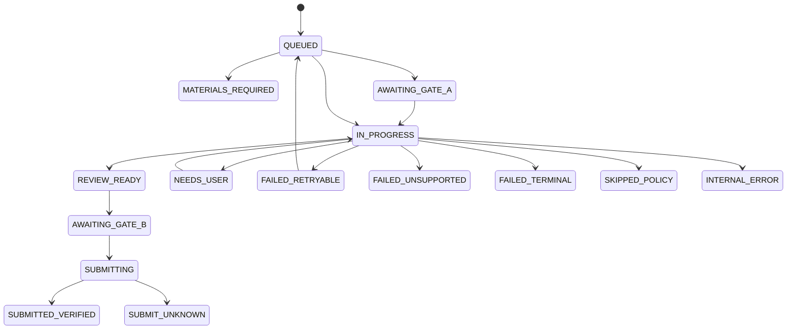

# Jobops Domain and Rules

This document is the authority for domain objects, lifecycle states, and business rules. Interface shapes belong in `CONTRACTS_AND_TESTS.md`; system ownership belongs in `ARCHITECTURE.md`.

## 核心对象

| Object | Meaning | Required identity / binding |
|---|---|---|
| `SearchProfile` | 用户批准的岗位搜索条件、hard filters 和 source 配置 | `profile_id`, `version` |
| `SourceObservation` | connector 返回的一条原始岗位观察；尚不是规范化岗位 | source, external ID/URL, observed time |
| `DiscoveryRun` | 一次 manual/scheduled collection 及各 source 结果 | run ID, profile version, trigger |
| `JobPosting` | 标准化后的岗位及其可申请目标 | `job_id`, source identity, content hash, revision |
| `PrioritizationPolicyDraft` | AI 对用户自然语言策略的结构化解释；尚未生效 | draft ID, subject ID, interpreter version, expiry |
| `PrioritizationPolicy` | 用户审核并批准的不可变求职策略 snapshot | policy ID, subject ID, version, content hash |
| `JobAnalysis` | 从某个 JD revision 提取的结构化 requirements 和 unknowns | job revision, analyzer version |
| `PriorityProposal` | Priority Agent 对单个岗位的 typed 建议；不是正式业务决定 | job/policy/candidate bindings, agent/prompt/model versions |
| `PriorityDecision` | Validation Gate 接受的 P0–P3、EXCLUDED 或 NEEDS_USER 及解释 | job revision/hash, policy version, candidate summary version, agent versions |
| `CandidateEvidence` | 可用于判断或材料的已验证候选人事实 | evidence ID, source, sensitivity, scope, verification time |
| `ResumeVersion` | 已审批、可追溯的基础或定制简历 | resume ID, revision, artifact hash, evidence bindings |
| `ApplicationPlan` | 本次申请的材料策略、回答范围和审批要求 | job revision, priority decision, policy version |
| `MaterialPackage` | Resume、Cover Letter 和 answers 的不可变申请材料包 | plan, evidence IDs, artifact hashes, package revision |
| `ApprovalDecision` | Gate A 或 Gate B 的明确审批记录 | actor, binding digest, decision time |
| `ApprovalPermit` | 由审批产生的签名、限时、一次性执行能力 | gate, run, digest, expiry, nonce |
| `ApplicationRun` | 一次可恢复、不可并发的 ATS 执行 | run ID, plan/package/policy revisions, lease |
| `ReviewSnapshot` | 提交前 DOM read-backs、uploaded bytes 和 validation 的安全绑定 | run, review hash, observed time |
| `SubmissionIntent` | Gate B 后、Submit 前持久化的单次副作用预留 | application key, review/material/answer/policy hashes |
| `EvidenceRef` | 对确认文本、URL、ATS ID、网络响应等证据的隐私安全引用 | kind, hash/URI, observed time |
| `HandoffRequest` | 需要用户处理后才能继续的最小任务 | run, reason code, safe checkpoint, requested action |
| `ApplicationOutcome` | 执行的标准化终态或暂停态 | run ID, exact status, evidence refs, retryability |

Candidate data is never inferred. `CandidateEvidence` is valid only when its source, sensitivity, scope, confirmation time, and optional expiry are known.

## 状态机

不同对象使用不同状态机。Priority 表示业务价值，lifecycle state 表示处理进度，二者不能合并。

### `DiscoveryRun`

```text
QUEUED → RUNNING → SUCCEEDED | PARTIAL | FAILED
```

`PARTIAL` means at least one connector succeeded and at least one failed. Successful observations are retained; each connector failure is recorded separately.

### `JobPosting`

```text
NORMALIZED
→ ANALYZED
→ PRIORITIZED
→ READY
→ QUEUED

Branches: DUPLICATE | EXCLUDED | SKIPPED | EXPIRED
```

- A `SourceObservation` becomes `JobPosting.NORMALIZED` only after schema and identity checks pass.
- `DUPLICATE` links to the canonical posting; it does not create a second application.
- `EXCLUDED` requires a failed hard filter.
- `EXPIRED` means the target is closed or no longer valid.

### `PrioritizationPolicyDraft` / `PrioritizationPolicy`

```text
DRAFT | NEEDS_CLARIFICATION | READY_FOR_APPROVAL
→ APPROVED | EXPIRED

PrioritizationPolicy:
ACTIVE → SUPERSEDED
```

A draft is an AI proposal and has no effect on Priority. Approval creates an
immutable version. Approving changed content supersedes the previous active
version without rewriting its content or historical decisions.

### `MaterialPackage`

```text
NOT_STARTED
→ DRAFT
→ VALIDATED
→ AWAITING_GATE_A
→ APPROVED

Branches: REJECTED | STALE
```

Any change to the job revision, selected evidence, generated text, answers, or artifact bytes makes the prior package and Gate A approval `STALE`.

### `ApplicationRun`



`NEEDS_USER` in the diagram represents the exact typed `NEEDS_USER_*` family. Re-entry to `IN_PROGRESS` requires a resolved handoff and full binding revalidation. `FAILED_RETRYABLE → QUEUED` is legal only under the retry rules below.

`SUBMIT_UNKNOWN` is a hard stop. Human reconciliation may attach eligible submission evidence or close the run; it never resumes Submit.

UI labels are read-only projections: `APPLYING` groups active run states, `MATERIALS_PENDING_APPROVAL` maps to `AWAITING_GATE_A`, `BLOCKED` groups non-runnable outcomes, and `SUBMITTED` means only `SUBMITTED_VERIFIED`. They are not additional writable domain states.

### `HandoffRequest`

```text
OPEN → RESOLVED | CANCELLED | EXPIRED
```

Resolving a handoff may resume from its recorded safe checkpoint only after revalidation; it never restarts submission blindly.

## 业务规则

### Priority policy and decision

Priority is an AI-assisted judgment against the user's current approved
`PrioritizationPolicy`, not a fixed global score or weighted formula. Ordinary
code may compute deterministic facts such as job age, but freshness has no
global numeric weight or automatic P0–P3 threshold.

| Decision | Stable business meaning |
|---|---|
| P0 | 立即处理。高度符合当前策略，并且通常具有时间敏感性，值得优先定制材料。 |
| P1 | 优先申请。整体价值较高，应当较快处理。 |
| P2 | 可以申请。具有一定价值，但可以排在后面或复用现有材料。 |
| P3 | 暂缓。当前策略下价值较低、匹配较弱、时间价值较低或存在明显顾虑。 |
| EXCLUDED | 违反用户明确批准的 hard constraint，不进入申请队列。 |
| NEEDS_USER | 关键 policy、候选人事实或岗位事实存在无法安全判断的歧义。 |

The Priority Agent cannot change these meanings. Every decision explains
positive signals, concerns and hard-constraint findings and binds the job
revision/content hash, approved policy ID/version, candidate summary version
and agent/prompt/model versions.

### Hard constraints and soft preferences

- A user may review a policy item as an approved hard constraint or a soft
  preference.
- `EXCLUDED` requires an explicit violation of an approved hard constraint.
- Unknown is not a hard-constraint failure and may produce `NEEDS_USER` when
  the ambiguity is decision-critical.
- A soft preference may influence the Agent proposal but Validation Gate cannot
  upgrade it to a hard constraint.
- AI-interpreted hard constraints remain draft data until user-confirmed and
  approved.
- Confirmed conflicts involving allowed/excluded country, excluded company,
  excluded role phrase or required work mode may be machine validated.
- Every `PriorityProposal` must explicitly cover work authorization,
  citizenship/permanent-residency, student status and security-clearance
  eligibility. Each category is reported as `SATISFIED`, `NOT_SATISFIED`,
  `UNKNOWN` or `NOT_APPLICABLE` with real job/candidate evidence when
  applicable.
- Citizenship or permanent-residency preference is not automatically an
  absolute eligibility failure. The posting's actual wording controls whether
  it is a requirement, a preference or unresolved.
- An unmet or unknown student-status requirement must affect the proposal:
  normally lower P0–P3 priority or produce `NEEDS_USER`. It may produce
  `EXCLUDED` only when the active policy contains the user-confirmed
  `EXCLUDED_STUDENT_ONLY_ROLE` hard constraint and the finding cites evidence.
- The user may instead keep student-only roles as an `ELIGIBILITY` soft
  preference. Validation must never promote that soft preference to a hard
  exclusion.
- Other hard-constraint concepts remain ambiguous until a stable typed
  representation is approved; they are not invented by the interpreter.
- Closed posting, invalid application target, or expired deadline → `EXPIRED`.
- Duplicate of an active or verified application → merge observations; never queue twice.
- Unsupported ATS → manual-only execution or `FAILED_UNSUPPORTED`; it is not a candidate mismatch.
- Model output remains a `PriorityProposal`; it cannot directly persist or
  execute P0–P3/EXCLUDED.
- A manual override records actor, reason, time, and prior decision version. It cannot override a confirmed hard filter or supply a missing sensitive fact.

### P0–P3 material strategy

| Priority | Resume / Cover Letter | Gate A | Gate B |
|---|---|---|---|
| P0 | Bespoke resume, visual QA, and narrative cover letter grounded in true evidence | Human | Human |
| P1 | Targeted resume; targeted letter when required or materially useful | Human | Human |
| P2 | Reuse an approved resume unchanged; letter only when required | Codex only if policy finds no risk | Human |
| P3 | No automatic tailoring or execution; user must explicitly promote or queue | If promoted, use resulting tier policy | Human |

P0/P1 may generate job-specific answer proposals only from the selected evidence; P2 uses exact approved facts and generates prose only when a required question cannot be answered verbatim. P1 may use a batch review UI, but each Gate A decision remains separately digest-bound.

This is the target P0–P3 policy. The current legacy High/Medium/Low projection is incompatible and must not consume a new `PriorityDecision`; the migration gap is recorded in `CONTRACTS_AND_TESTS.md`.

### Resume selection

1. Keep only approved, unexpired variants whose bytes match the recorded hash.
2. Reject variants whose evidence bindings are stale or outside the current scope.
3. Score eligible variants against role family and required skills using versioned deterministic rules.
4. Break ties by role-family specificity, newest approval time, then stable resume ID.
5. P0/P1 material generation records the base resume, changed sections, and evidence lineage. P2 uses the selected bytes unchanged.
6. No eligible variant produces `MATERIALS_REQUIRED`; browser execution must not begin.

### Approval

- Gate A approves the exact `ApplicationPlan` and `MaterialPackage` before browser execution.
- Gate A binds job URL/revision, priority, answers, evidence IDs, artifact hashes, validation results, and policy version.
- Gate B approves a persisted `ReviewSnapshot` from an earlier invocation and binds DOM read-backs plus uploaded bytes.
- Gate B bindings are recomputed immediately before submission.
- Gate A and Gate B are separate decisions; one invocation cannot grant both human approvals.
- Permits are signed, expiring, one-time, actor-attributed, and digest-bound.
- Approval never overrides a stale package, unsafe page, missing fact, invalid lease, or policy blocker.

### Retry / no-retry

Automatic retry is allowed only when all are true:

- the outcome is explicitly retryable;
- no submission intent was reserved and Submit was not clicked;
- the phase is idempotent and has a persisted safe checkpoint;
- package, policy, and target bindings are unchanged;
- the attempt and timeout budget remains.

Retryable examples:

- transient source, network, browser-start, or pre-submit page-load failure;
- read-only page stabilization before any changed read-back;
- one source failing while other discovery sources complete;
- resume from a valid pre-submit checkpoint after lease loss.

Never auto-retry:

- `SUBMIT_UNKNOWN`, any prior submission intent, or any visible submission confirmation;
- CAPTCHA, MFA, email verification, account lock, or anti-bot challenge;
- unknown or ambiguous candidate answer, especially a sensitive answer;
- missing/stale evidence, materials, approval, permit, review, or artifact bytes;
- policy block, unsupported ATS/control, schema violation, or read-back mismatch.

### Handoff

Create `HandoffRequest` when human action or judgment is required and record:

- typed reason code;
- the last safe checkpoint;
- exactly what the user must do;
- what Jobops will verify before resuming;
- expiry or invalidation conditions.

Handoff is required for authentication/security challenges, new sensitive answers, unresolved required controls, material approval, Gate B, unsupported execution, and `SUBMIT_UNKNOWN` reconciliation. It must not expose secrets or ask the user to repeat already verified data.

### Queue ordering

Eligible jobs are ordered by:

1. P0, then P1, then P2; P3 only when explicitly queued;
2. posting time descending, with unknown time after known time;
3. discovery time ascending;
4. stable `job_id`.

Final reprioritization triggers and within-tier queue policy belong to P1d.

An explicit user priority override changes the versioned `PriorityDecision`; it cannot bypass hard filters. The queue excludes duplicates, expired/excluded jobs, active runs, verified submissions, unresolved `SUBMIT_UNKNOWN`, and entries whose required material or approval is missing.

Only one application episode may run at a time. A job entering `NEEDS_USER`, `MATERIALS_REQUIRED`, or another blocker leaves the runnable set so the queue can continue with the next eligible job.
