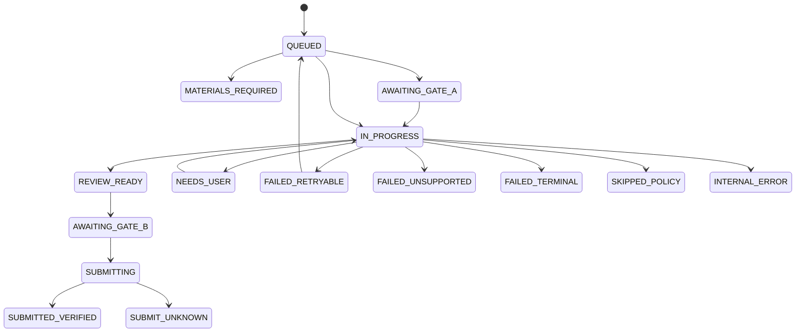

# Jobops Domain and Rules

This document is the authority for domain objects, lifecycle states, and business rules. Interface shapes belong in `CONTRACTS_AND_TESTS.md`; system ownership belongs in `ARCHITECTURE.md`.

## 核心对象

| Object | Meaning | Required identity / binding |
|---|---|---|
| `SearchProfile` | 用户批准的岗位搜索条件、hard filters 和 source 配置 | `profile_id`, `version` |
| `SourceObservation` | connector 返回的一条原始岗位观察；尚不是规范化岗位 | source, external ID/URL, observed time |
| `DiscoveryRun` | 一次 manual/scheduled collection 及各 source 结果 | run ID, profile version, trigger |
| `JobPosting` | 标准化后的岗位及其可申请目标 | `job_id`, source identity, content hash, revision |
| `AcceptedJobIntent` | 某个 subject 在成功 Discovery 后明确接受的 add/apply 业务意图；不是执行许可 | subject ID, job ID, intent, proposal ID, Discovery run ID |
| `PrioritizationPolicyDraft` | AI 对用户自然语言策略的结构化解释；尚未生效 | draft ID, subject ID, interpreter version, expiry |
| `PrioritizationPolicy` | 用户审核并批准的不可变求职策略 snapshot | policy ID, subject ID, version, content hash |
| `JobAnalysis` | 从某个 JD revision 提取的结构化 requirements 和 unknowns | job revision, analyzer version |
| `PriorityProposal` | Priority Agent 对单个岗位的 typed 建议；不是正式业务决定 | job/policy/candidate bindings, agent/prompt/model versions |
| `PriorityDecision` | Validation Gate 接受的 P0–P3、EXCLUDED 或 NEEDS_USER 及解释 | job revision/hash, policy version, candidate summary version, agent versions |
| `CandidateEvidence` | 可用于判断或材料的已验证候选人事实 | evidence ID, source, sensitivity, scope, verification time |
| `ResumeCandidate` | subject 显式注册、hash 校验且可供后续基础简历选择的只读 artifact projection | subject ID, stable resume ID, artifact hash, trusted summary hash |
| `ResumeSelectionDecision` | 针对一个 ApplicationPlan 自动选择的不可变基础简历绑定 | plan/job binding, candidate-set hash, source resume ID/hash, selector versions |
| `SourceResumeProjection` | 受管理源简历的忠实、可引用结构投影；不是 CandidateEvidence | subject/resume/artifact hash, parser version, projection hash |
| `ResumeVersion` | 已审批、可追溯的基础或定制简历 | resume ID, revision, artifact hash, evidence bindings |
| `ApplicationPlan` | automation-first 的单职位准备授权、阶段、运行时用户要求和人工例外策略 | subject/job revision, priority decision, policy version, accepted intent, instruction hash |
| `MaterialPackage` | Resume、Cover Letter 和 answers 的不可变申请材料包 | plan, evidence IDs, artifact hashes, package revision |
| `ApprovalDecision` | Gate A 或 Gate B 的明确审批记录 | actor, binding digest, decision time |
| `ApprovalPermit` | 由审批产生的签名、限时、一次性执行能力 | gate, run, digest, expiry, nonce |
| `ApplicationRun` | 一次可恢复、不可并发的 ATS 执行 | run ID, plan/package/policy revisions, lease |
| `ReviewSnapshot` | 提交前 DOM read-backs、uploaded bytes 和 validation 的安全绑定 | run, review hash, observed time |
| `SubmissionIntent` | Gate B 后、Submit 前持久化的单次副作用预留 | application key, review/material/answer/policy hashes |
| `EvidenceRef` | 对确认文本、URL、ATS ID、网络响应等证据的隐私安全引用 | kind, hash/URI, observed time |
| `HandoffRequest` | 需要用户处理后才能继续的最小任务 | run, reason code, safe checkpoint, requested action |
| `ApplicationOutcome` | 执行的标准化终态或暂停态 | run ID, exact status, evidence refs, retryability |

Candidate data is never inferred. `CandidateEvidence` is valid only when its source, sensitivity, scope, confirmation time, and optional expiry are known.

## 状态机

不同对象使用不同状态机。Priority 表示业务价值，lifecycle state 表示处理进度，二者不能合并。

### `DiscoveryRun`

```text
QUEUED → RUNNING → SUCCEEDED | PARTIAL | FAILED
```

`PARTIAL` means at least one connector succeeded and at least one failed. Successful observations are retained; each connector failure is recorded separately.

### `JobPosting`

```text
NORMALIZED
→ ANALYZED
→ PRIORITIZED
→ READY
→ QUEUED

Branches: DUPLICATE | EXCLUDED | SKIPPED | EXPIRED
```

- A `SourceObservation` becomes `JobPosting.NORMALIZED` only after schema and identity checks pass.
- `DUPLICATE` links to the canonical posting; it does not create a second application.
- `EXCLUDED` requires a failed hard filter.
- `EXPIRED` means the target is closed or no longer valid.

### `PrioritizationPolicyDraft` / `PrioritizationPolicy`

```text
DRAFT | NEEDS_CLARIFICATION | READY_FOR_APPROVAL
→ APPROVED | EXPIRED

PrioritizationPolicy:
ACTIVE → SUPERSEDED
```

A draft is an AI proposal and has no effect on Priority. Approval creates an
immutable version. Approving changed content supersedes the previous active
version without rewriting its content or historical decisions.

### Accepted job intent

- An accepted intent is persisted only after Discovery accepts the proposal
  and returns the formal `job_id` and Discovery run identity.
- It is immutable, subject-specific and separate from `JobPosting`,
  process-local `PendingIntake`, Priority and the Application Engine's
  submission-intent reservation.
- `REQUEST_APPLICATION` has precedence over `ADD_JOB` for the same subject and
  job. A later `ADD_JOB` does not cancel an existing request; cancellation
  requires a future explicit typed action.
- Missing historical intent is `NOT_FOUND`. Priority, timestamps, conversation
  state and job source never imply application intent.
- `REQUEST_APPLICATION` permits later read models to consider preparation
  eligibility; it does not create an `ApplicationPlan`, approve materials,
  reserve Submit or authorize execution.

### `ApplicationPlan`

- A plan is created only from one explicitly selected P1d4 `RUNNABLE` item.
  Priority, policy and accepted-intent bindings come from that same snapshot;
  the creator does not perform independent repository lookups.
- The immutable identity binds subject, job revision/content hash, formal
  Decision ID, policy ID/version/hash, accepted REQUEST_APPLICATION intent,
  priority, plan contract version, fixed stages and the exact runtime
  instruction hash. Creation time is audit metadata, not identity.
- The default policy is `AUTOMATION_FIRST`. Safe resume selection/tailoring,
  cover-letter work, answer drafting, Fact QA, Visual QA and material assembly
  proceed asynchronously without requiring the user to remain present.
- `DEFER_ITEM_AND_CONTINUE` means an unresolved human-only issue pauses only the
  current job. A later Human Attention Queue records that exception while other
  jobs continue; P2a1 defines the policy but does not implement that queue.
- User preparation instructions are plan-scoped runtime data, preserved
  exactly and never written to static Agent instructions or another job.
- A plan permits preparation to begin. It does not mean materials are complete,
  satisfy Gate A, authorize browser execution or authorize submission.

### Trusted resume candidates

- Only an artifact explicitly registered from Private Home
  `documents/master/` can become a `ResumeCandidate`; loose
  `default_resume`, `resume_variants` and runtime fallback paths are not
  candidates.
- Registration reads the actual PDF or DOCX bytes, computes SHA-256 locally
  and copies them to an immutable, subject-scoped preparation artifact path.
  A caller-provided hash is never authoritative.
- The selection-safe summary is accepted only from an authenticated caller as
  either verified or user-confirmed data. P2a2 performs no model inference or
  resume selection.
- Candidate identity binds subject, artifact hash/type, display name, exact
  summary and its trust metadata, selectable status and contract version.
  `recorded_at` is audit metadata. Changed content creates a different record;
  identical registration returns the original immutable record.
- Reads re-hash the managed artifact. A missing artifact, mismatched bytes or
  corrupt record fails the complete typed read/list operation rather than
  silently shrinking the candidate set.

### Automatic base resume selection

- P2a3 starts from one persisted `ApplicationPlan`, then loads one typed
  `JobPosting` and requires exact job ID, revision and content-hash equality
  with the plan before reading candidates.
- The complete candidate set comes only from
  `ResumeCandidateProvider.list_selectable(subject_id)`. No loose profile path,
  filesystem scan or legacy routing value participates.
- Zero candidates defers only that plan. One candidate is selected by ordinary
  code with zero Agent calls. More than one candidate permits one bounded,
  tool-free Agent call over the trusted JD, selection-safe projections and
  exact plan-scoped instructions.
- The Agent may return only one supplied resume ID, candidate contract version,
  artifact hash and bounded rationale. Ordinary code verifies all three
  bindings; refusal, ambiguity or an unknown/mismatched candidate defers the
  plan without retry or a successful Decision.
- The pre-Agent selection binding covers plan/job bindings, candidate-set
  canonical hash, selection contract and configured Agent/prompt/model
  versions. A completed identical binding returns the immutable existing
  Decision without another Agent call. `selected_at` is audit metadata.
- Selection chooses source bytes only. It does not tailor a resume, approve
  materials, create Human Attention state or authorize execution/submission.

### Source resume projection

- P2a4a reads only a subject-owned `ResumeCandidate`; it never accepts an
  external path or scans for documents. Managed bytes are re-hashed before
  parsing and must still match the candidate artifact binding.
- PDF projection uses deterministic page and extracted-line indices. DOCX
  projection uses body paragraph indices and explicit table/row/cell/paragraph
  indices. Parser normalization trims only surrounding extractor whitespace;
  it does not rewrite, infer or complete source text.
- Section recognition is limited to versioned heading/list rules. Content that
  does not match those rules stays a paragraph or table-cell block.
- Stable section, block and bullet IDs depend on artifact hash, structural
  locator, parser version and projection contract—not path, mtime or runtime.
- A `SourceResumeProjection` is source evidence material, not a verified
  `CandidateEvidence` snapshot. P2a4a performs no truth/capability judgment,
  OCR, model call, tailoring, rendering, approval or execution.

### CandidateEvidence snapshot

- P2a4b accepts evidence only from a typed `SourceResumeProjection` bound to
  the subject, selected resume and artifact hash. Selection-safe summaries,
  CandidateSummary, CandidateVault profile fields, JD content and legacy
  profile data are not evidence inputs.
- Every non-empty source block becomes one item in projection section/block
  order. Text, source section/block/bullet IDs and typed locators are copied
  exactly; no skill, responsibility, causality, number or outcome is inferred.
- Resume-source evidence uses sensitivity `PERSONAL`, allowed scope
  `RESUME_TAILORING`, and verification
  `USER_PROVIDED_DOCUMENT_STATEMENT`. This means the user supplied the document;
  it does not claim independent third-party verification.
- Source-resume items have `verified_at=None` and `expires_at=None`. Their
  recorded time comes from the immutable source projection. No expiry is
  invented.
- Evidence and snapshot IDs bind stable source and upstream immutable
  identities, never path, mtime or runtime creation time. Changed Plan,
  Selection, artifact, Projection or contract creates a new immutable snapshot.
- P2a4b does not judge JD alignment, ingest additional CandidateVault evidence,
  tailor content, run Fact/Visual QA or authorize preparation execution.

### Evidence-bound resume tailoring

- P2a4c rewrites resume content only inside the bound
  `CandidateEvidenceSnapshot`. CandidateSummary, selection-safe summaries and
  ordinary profile fields are never tailoring facts.
- The Resume Tailoring Agent policy is static and versioned:
  `Action Verb + Details + Outcome = Skill Statement`, weak verbs banned, JD
  verbs reusable only with evidence support, no new numbers, skills,
  experience, titles, degrees, duties or outcomes without evidence.
- Instruction priority is fixed: facts and the fabrication ban > the current
  Plan's user preparation instructions > JD alignment > default style. User
  instructions are passed verbatim and never edit the global policy.
- The Agent may rewrite, condense, reorder or omit bullets and reorder
  sections; it must not change identity facts (names, companies, titles,
  degrees, dates) or return free text instead of the typed result.
- Every source block must be accounted for exactly once with change type
  `UNCHANGED | REWRITTEN | REORDERED | OMITTED`. Rewritten bullets carry at
  least one valid evidence ID, their source reference and a verbatim JD
  alignment reference.
- Deterministic validation rejects unknown evidence, sections or blocks,
  unevidenced numbers or proper-noun facts, JD verbs without cited evidence,
  weak leading verbs and omission of source text quoted in user instructions.
  Violations defer the item as `DEFERRED_NEEDS_HUMAN` without auto-retry.
- Draft identity binds all upstream immutable identities plus
  Agent/prompt/model/policy/contract versions, never time. A completed
  binding replays `UNCHANGED` with zero Agent calls.
- A `TailoredResumeDraft` is an unreviewed AI rewrite. It authorizes no final
  rendering, Fact QA, Visual QA, human approval or execution.

### Resume fact QA

- P2a5 is an independent gate. Passing the P2a4c validator is never evidence
  that a draft is factually sound; P2a5 re-derives every checkable fact and
  shares no validator with the tailoring Slice.
- Any subject, plan, job revision, artifact, projection, evidence or content
  hash mismatch returns `BLOCKED_BINDING_MISMATCH` with zero Agent calls and
  no persisted result.
- Deterministic checks run first: reference existence, `RESUME_TAILORING`
  scope, source coverage and duplication, verbatim `UNCHANGED`/`REORDERED`
  text, at least one usable evidence reference per rewritten bullet, and
  every number, date, company, title, degree and tool name present in cited
  evidence. A blocking deterministic finding blocks without a model call.
- A JD alignment reference absent from the bound job description is
  `ADVISORY`: it is a provenance defect, not a false candidate claim, so it
  is recorded without blocking.
- The bounded QA Agent is called at most once, only for genuinely semantic
  questions, and receives only rewritten bullets and tailoring-scoped
  evidence — never the JD, projection, CandidateSummary or profile fields.
- The Agent may judge only evidence support: unsupported action verbs,
  overstated ownership, overstated maturity, unsupported impact, unsupported
  causality and out-of-scope claims. Participation written as leadership, a
  prototype written as production deployment, tool use written as business
  impact, and asserted causality the evidence does not state are all
  unsupported.
- The Agent returns findings and a verdict only. It cannot modify the draft,
  propose replacement bullets or call tools. Ordinary code revalidates every
  finding's bullet and evidence references.
- Verdicts are `PASSED`, `BLOCKED` or `DEFERRED`. Unknown references, illegal
  or contradictory output and an uncertain verdict defer the item for a human
  without auto-retry and without blocking other jobs.
- QA identity binds the draft ID and hash, projection, evidence snapshot and
  QA/Agent/prompt/model/policy versions, never time. A completed binding
  replays as `UNCHANGED` with zero Agent calls whatever its verdict.
- `PASSED` covers facts only. It is not layout or visual approval, material
  approval, or authority to render or submit anything.

### Managed LaTeX resume versions

- P2a6a registers only an explicitly submitted `.tex` source, inline or from
  a path already inside Private Home. It never scans a user directory and
  never imports a file on its own initiative.
- Managed bytes are copied into a subject-isolated location under Private
  Home. Nothing downstream may depend on the original external path.
- The SHA-256 is always computed from the actual managed UTF-8 bytes. A
  caller-declared hash is never trusted.
- Registration rejects plainly unsafe capabilities: shell escape, external
  program execution, file writes, file reads and absolute or home-relative
  include paths. Relative includes remain legal. This is admission control,
  not compile safety; sandboxed compilation remains a later Slice.
- Many LaTeX versions and many root families may be valid at once. There is
  no unique `current_resume.tex` and no single ACTIVE version.
- Nothing overwrites history. An AI revision or template derivation creates a
  new version recording `parent_version_id`.
- A parent must exist under the same subject, and the child inherits that
  parent's root family. A supplied family contradicting the parent fails
  closed.
- A first parentless version derives a new stable root family from its own
  binding. Family is never guessed from a filename or a timestamp.
- User-provided, imported, system-template-derived, AI-generated and
  AI-revised sources share one registry but keep distinct source kinds.
- Version identity binds subject, managed source reference and hash, source
  kind, parent, root family, template, source resume, draft and fact-QA
  bindings, normalized labels and contract version. Time is excluded.
- Identical identity replays as `UNCHANGED` without duplicating the managed
  artifact or the record, preserving the original creation time. Different
  content under the same identity is an integrity conflict.
- `list_selectable()` returns typed versions in stable version-ID order,
  never depending on directory traversal, filename or mtime.
- Having no LaTeX version is normal, not a deferral. Optional draft and
  fact-QA bindings are recorded as provenance only; P2a6b verifies that a
  bound fact-QA result actually passed.

### Base LaTeX version selection

- Only a `PASSED` `ResumeFactQAResult` naming this exact draft, with a
  matching content hash, may reach LaTeX selection. `BLOCKED` and `DEFERRED`
  never do.
- Candidates come only from `list_selectable()` for this subject. No
  directory is scanned, no `.tex` is parsed, and no other subject's versions
  are visible.
- A candidate declaring fact-QA provenance has that record re-read, its hash
  compared and its verdict confirmed `PASSED`. Corrupt provenance fails
  closed for the whole selection.
- Selection reads version metadata only. LaTeX source content is never read
  and never reaches the Agent.
- Deterministic order, all with zero Agent calls: an explicit version or
  family requirement present as a literal ID in the plan instructions; no
  candidate at all; a single candidate; a unique version bound to the current
  source resume. Recency and filename are never selection signals.
- No LaTeX history is an ordinary `MANAGED_TEMPLATE_FALLBACK`, never a reason
  to ask the user for anything.
- Only a genuine remaining tie calls the bounded Agent, at most once, over
  the trusted JD, verbatim user instructions and restricted version metadata.
  It may return one supplied candidate, the managed template, or a human
  request, and nothing else.
- An unknown version, an illegal structure or a human request degrades to the
  managed template rather than interrupting the user — unless the plan
  carried an explicit version or family requirement that cannot be satisfied,
  which defers the item as `DEFERRED_NEEDS_HUMAN`.
- `MANAGED_TEMPLATE_FALLBACK` states only that the managed default template
  applies. No template file is chosen or implemented at this stage.
- Decision identity binds plan, draft ID and hash, passed fact-QA ID and
  hash, job revision and hash, source resume, candidate-set hash and
  Agent/prompt/model/contract versions, excluding time. A completed binding
  replays `UNCHANGED` with zero Agent calls.
- Selecting a base version says nothing about whether LaTeX has been
  generated, compiles, passes Visual QA or may be submitted.

### `MaterialPackage`

```text
NOT_STARTED
→ DRAFT
→ VALIDATED
→ AWAITING_GATE_A
→ APPROVED

Branches: REJECTED | STALE
```

Any change to the job revision, selected evidence, generated text, answers, or artifact bytes makes the prior package and Gate A approval `STALE`.

### `ApplicationRun`



`NEEDS_USER` in the diagram represents the exact typed `NEEDS_USER_*` family. Re-entry to `IN_PROGRESS` requires a resolved handoff and full binding revalidation. `FAILED_RETRYABLE → QUEUED` is legal only under the retry rules below.

`SUBMIT_UNKNOWN` is a hard stop. Human reconciliation may attach eligible submission evidence or close the run; it never resumes Submit.

UI labels are read-only projections: `APPLYING` groups active run states, `MATERIALS_PENDING_APPROVAL` maps to `AWAITING_GATE_A`, `BLOCKED` groups non-runnable outcomes, and `SUBMITTED` means only `SUBMITTED_VERIFIED`. They are not additional writable domain states.

### `HandoffRequest`

```text
OPEN → RESOLVED | CANCELLED | EXPIRED
```

Resolving a handoff may resume from its recorded safe checkpoint only after revalidation; it never restarts submission blindly.

## 业务规则

### Priority policy and decision

Priority is an AI-assisted judgment against the user's current approved
`PrioritizationPolicy`, not a fixed global score or weighted formula. Ordinary
code may compute deterministic facts such as job age, but freshness has no
global numeric weight or automatic P0–P3 threshold.

| Decision | Stable business meaning |
|---|---|
| P0 | 立即处理。高度符合当前策略，并且通常具有时间敏感性，值得优先定制材料。 |
| P1 | 优先申请。整体价值较高，应当较快处理。 |
| P2 | 可以申请。具有一定价值，但可以排在后面或复用现有材料。 |
| P3 | 暂缓。当前策略下价值较低、匹配较弱、时间价值较低或存在明显顾虑。 |
| EXCLUDED | 违反用户明确批准的 hard constraint，不进入申请队列。 |
| NEEDS_USER | 关键 policy、候选人事实或岗位事实存在无法安全判断的歧义。 |

The Priority Agent cannot change these meanings. Every decision explains
positive signals, concerns and hard-constraint findings and binds the job
revision/content hash, approved policy ID/version, candidate summary version
and agent/prompt/model versions.

### Hard constraints and soft preferences

- A user may review a policy item as an approved hard constraint or a soft
  preference.
- `EXCLUDED` requires an explicit violation of an approved hard constraint.
- Unknown is not a hard-constraint failure and may produce `NEEDS_USER` when
  the ambiguity is decision-critical.
- A soft preference may influence the Agent proposal but Validation Gate cannot
  upgrade it to a hard constraint.
- AI-interpreted hard constraints remain draft data until user-confirmed and
  approved.
- Confirmed conflicts involving allowed/excluded country, excluded company,
  excluded role phrase or required work mode may be machine validated.
- Every `PriorityProposal` must explicitly cover work authorization,
  citizenship/permanent-residency, student status and security-clearance
  eligibility. Each category is reported as `SATISFIED`, `NOT_SATISFIED`,
  `UNKNOWN` or `NOT_APPLICABLE` with real job/candidate evidence when
  applicable.
- Citizenship or permanent-residency preference is not automatically an
  absolute eligibility failure. The posting's actual wording controls whether
  it is a requirement, a preference or unresolved.
- An unmet or unknown student-status requirement must affect the proposal:
  normally lower P0–P3 priority or produce `NEEDS_USER`. It may produce
  `EXCLUDED` only when the active policy contains the user-confirmed
  `EXCLUDED_STUDENT_ONLY_ROLE` hard constraint and the finding cites evidence.
- The user may instead keep student-only roles as an `ELIGIBILITY` soft
  preference. Validation must never promote that soft preference to a hard
  exclusion.
- Other hard-constraint concepts remain ambiguous until a stable typed
  representation is approved; they are not invented by the interpreter.
- Closed posting, invalid application target, or expired deadline → `EXPIRED`.
- Duplicate of an active or verified application → merge observations; never queue twice.
- Unsupported ATS → manual-only execution or `FAILED_UNSUPPORTED`; it is not a candidate mismatch.
- Model output remains a `PriorityProposal`; it cannot directly persist or
  execute P0–P3/EXCLUDED.
- A manual override records actor, reason, time, and prior decision version. It cannot override a confirmed hard filter or supply a missing sensitive fact.

### Preparation admission policy

The approved `PrioritizationPolicy` contains a versioned preparation-admission
snapshot. A new draft defaults to direct eligibility for P0, P1 and P2, with P3
requiring a separate explicit promotion. These are editable policy defaults,
not a global rule hard-coded by a downstream queue.

- Directly eligible priorities and explicit-promotion priorities are typed,
  duplicate-free, deterministically ordered and disjoint.
- `NEEDS_USER` and `EXCLUDED` can never be configured in either set.
- Admission changes follow draft → review → approval and create a new policy
  content hash/version; an ACTIVE policy is never edited in place.
- An old approved policy without this snapshot is incompatible and requires a
  separate explicit migration before reapproval. Runtime readers do not inject
  defaults or alter its original hash; P1a2 does not implement that migration.
- Admission means only that a current Decision may be considered for
  Application Preparation. It does not supply `REQUEST_APPLICATION` intent,
  override lifecycle or Gate blockers, create an `ApplicationPlan`, authorize
  browser/ATS execution, or authorize submission.
- P3 promotion is policy vocabulary only in P1a2; the promotion fact and command
  remain a later Slice.

### P0–P3 material strategy

| Priority | Resume / Cover Letter | Gate A | Gate B |
|---|---|---|---|
| P0 | Bespoke resume, visual QA, and narrative cover letter grounded in true evidence | Human | Human |
| P1 | Targeted resume; targeted letter when required or materially useful | Human | Human |
| P2 | Reuse an approved resume unchanged; letter only when required | Codex only if policy finds no risk | Human |
| P3 | No automatic tailoring or execution; user must explicitly promote or queue | If promoted, use resulting tier policy | Human |

P0/P1 may generate job-specific answer proposals only from the selected evidence; P2 uses exact approved facts and generates prose only when a required question cannot be answered verbatim. P1 may use a batch review UI, but each Gate A decision remains separately digest-bound.

Resume tailoring remains evidence-bound. A tailored bullet should prefer
`Action Verb + Details + Outcome`, reuse job-specific action verbs only when
they truthfully match verified experience, and avoid weak verbs where a
truthful precise verb exists. Every Outcome must come from CandidateEvidence;
the model may not invent metrics, scope or impact.

This is the target P0–P3 policy. The current legacy High/Medium/Low projection is incompatible and must not consume a new `PriorityDecision`; the migration gap is recorded in `CONTRACTS_AND_TESTS.md`.

### Resume selection

1. Keep only approved, unexpired variants whose bytes match the recorded hash.
2. Reject variants whose evidence bindings are stale or outside the current scope.
3. Score eligible variants against role family and required skills using versioned deterministic rules.
4. Break ties by role-family specificity, newest approval time, then stable resume ID.
5. P0/P1 material generation records the base resume, changed sections, and evidence lineage. P2 uses the selected bytes unchanged.
6. No eligible variant produces `MATERIALS_REQUIRED`; browser execution must not begin.

### Approval

- Gate A approves the exact `ApplicationPlan` and `MaterialPackage` before browser execution.
- Gate A binds job URL/revision, priority, answers, evidence IDs, artifact hashes, validation results, and policy version.
- Gate B approves a persisted `ReviewSnapshot` from an earlier invocation and binds DOM read-backs plus uploaded bytes.
- Gate B bindings are recomputed immediately before submission.
- Gate A and Gate B are separate decisions; one invocation cannot grant both human approvals.
- Permits are signed, expiring, one-time, actor-attributed, and digest-bound.
- Approval never overrides a stale package, unsafe page, missing fact, invalid lease, or policy blocker.

### Retry / no-retry

Automatic retry is allowed only when all are true:

- the outcome is explicitly retryable;
- no submission intent was reserved and Submit was not clicked;
- the phase is idempotent and has a persisted safe checkpoint;
- package, policy, and target bindings are unchanged;
- the attempt and timeout budget remains.

Retryable examples:

- transient source, network, browser-start, or pre-submit page-load failure;
- read-only page stabilization before any changed read-back;
- one source failing while other discovery sources complete;
- resume from a valid pre-submit checkpoint after lease loss.

Never auto-retry:

- `SUBMIT_UNKNOWN`, any prior submission intent, or any visible submission confirmation;
- CAPTCHA, MFA, email verification, account lock, or anti-bot challenge;
- unknown or ambiguous candidate answer, especially a sensitive answer;
- missing/stale evidence, materials, approval, permit, review, or artifact bytes;
- policy block, unsupported ATS/control, schema violation, or read-back mismatch.

### Handoff

Create `HandoffRequest` when human action or judgment is required and record:

- typed reason code;
- the last safe checkpoint;
- exactly what the user must do;
- what Jobops will verify before resuming;
- expiry or invalidation conditions.

Handoff is required for authentication/security challenges, new sensitive answers, unresolved required controls, material approval, Gate B, unsupported execution, and `SUBMIT_UNKNOWN` reconciliation. It must not expose secrets or ask the user to repeat already verified data.

### Queue ordering

Jobs admitted by the current approved policy are ordered by:

1. the policy's directly eligible priorities in P0→P3 order; a priority in its
   explicit-promotion set is included only after a separate promotion fact;
2. posting time descending, with unknown time after known time;
3. discovery time ascending;
4. stable `job_id`.

Final reprioritization triggers and within-tier queue policy belong to P1d.

An explicit user priority override changes the versioned `PriorityDecision`; it cannot bypass hard filters. The queue excludes duplicates, expired/excluded jobs, active runs, verified submissions, unresolved `SUBMIT_UNKNOWN`, and entries whose required material or approval is missing.

Only one application episode may run at a time. A job entering `NEEDS_USER`, `MATERIALS_REQUIRED`, or another blocker leaves the runnable set so the queue can continue with the next eligible job.

### Current priority read model

P1d2 is not the eligible application queue above. It is a read-only projection
of existing priority work for one explicit subject and evaluation time:

- `CURRENT`: a completed P1d1 binding exactly matches the current job, ACTIVE
  policy, CandidateSummary, Agent/prompt/model, time, Gate and orchestration
  versions;
- `STALE`: completed history exists, but one or more of those immutable binding
  fields differs;
- `MISSING`: no completed priority orchestration exists for the job;
- `INCOMPLETE`: the exact current binding exists but is not completed.

Only `CURRENT` items expose a current Proposal and Decision. Historical
decisions may explain staleness but never masquerade as current. The read model
groups CURRENT, STALE, MISSING and INCOMPLETE; within CURRENT it uses only the
persisted Decision order P0, P1, P2, P3, NEEDS_USER, EXCLUDED, then
`validated_at` and `job_id`. It performs no reprioritization and does not decide
application eligibility.

### Selective batch reprioritization

P1d3 may recompute only the `STALE` and `MISSING` items reported by one P1d2
snapshot. `CURRENT` is skipped, and `INCOMPLETE` is never recovered or rerun by
the batch layer. An explicit job ID absent from the snapshot is not looked up
through another path.

Every batch must be bounded by a non-empty explicit job allowlist or a positive
`max_jobs`. Explicit IDs retain caller order after first-occurrence
deduplication; otherwise selection retains P1d2 order. Each selected job is
passed to P1d1 once, serially, with the same explicit evaluation time. Typed
single-job failures do not roll back prior successes and do not prevent later
selected jobs from running.

P1d3 owns no scoring, binding, Agent, Gate or persistence behavior and has no
batch checkpoint. Repeated execution relies on a fresh P1d2 snapshot and
P1d1's existing atomic idempotency. A recomputed PriorityDecision remains
informational and does not enter an application queue automatically.

### Runnable Application Preparation read model

P1d4 calls P1d2 once and uses the exact ACTIVE policy snapshot returned by that
queue build. It does not repeat policy lookup or recompute Priority state. A
job is runnable for preparation only when the P1d2 item is `CURRENT`, its
formal Decision is qualified, the subject has an authoritative
`REQUEST_APPLICATION` intent, the Decision priority belongs to the snapshot's
direct preparation-admission set, and the JobPosting lifecycle remains usable.

Priority never substitutes for user intent: `ADD_JOB` and an authoritative
absence of intent are both blocked. STALE, MISSING and INCOMPLETE are not
recomputed by this read model. NEEDS_USER and EXCLUDED remain blocked, a
priority in the explicit-promotion set requires a separate future promotion
fact, and a priority in neither admission set is not runnable. Intent integrity
failure fails the whole view rather than masquerading as no intent. P1d4
preserves P1d2 order and performs no claim, save, preparation or execution.
